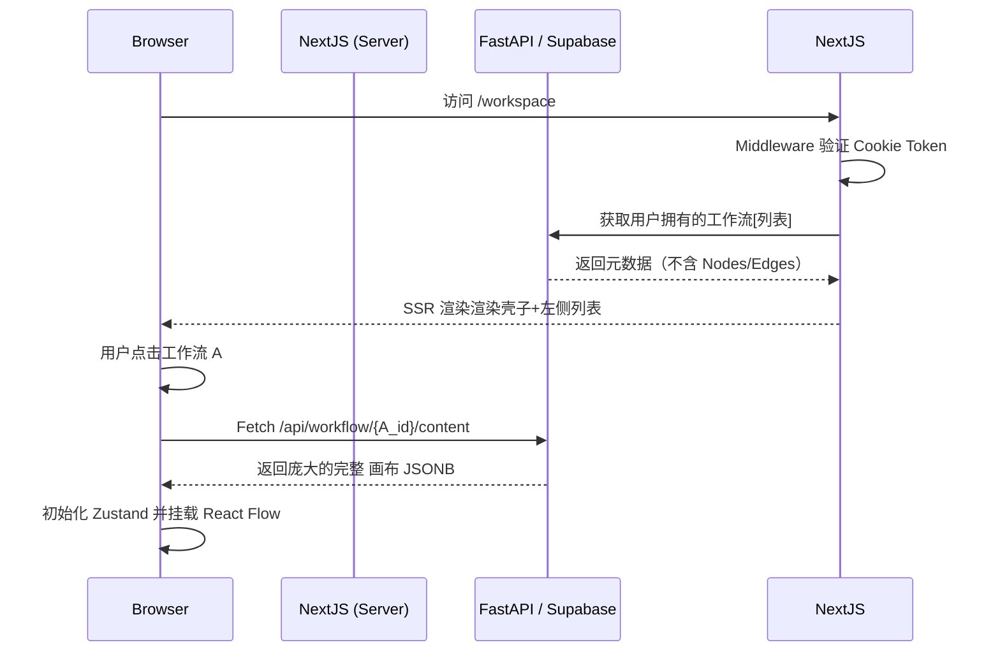

# 用户认证体系：大厂级登录态管理

> 本文档用于定义 `StudySolo` 中关于用户登录、会话保持、权限校验以及路由守卫的实现策略。

## 1. 业务场景需求总结

我们需要实现“一比一复刻实际企业大厂的方式”的登录机制。针对核心系统（如核心的“工作流画布”部分），实施以下策略：

1. **强登录阻断**：进入应用（特定路由或核心功能）前必须登录。
2. **多端状态同步问题**：如何确保同一用户在不同标签页/窗口的登录登出状态是一致的。
3. **安全与静默刷新**：确保用户在长时间停留在应用时不会突然被踢出，拥有无感知的 token 刷新机制。
4. **懒加载与预获取**：登录成功后，后台静默拉取该用户的所有工作流列表数据，但不立即拉取画布的具体 JSON 内容数据。

---

## 2. 大厂常用认证方案预研 (Authentication Patterns)

在 Next.js 16 + FastAPI 架构下，常见的认证方案有 JWT、Cookie/Session 等。

### 2.1 基于 HttpOnly Cookie 的 JWT / Session (推荐)

大厂（如字节跳动、腾讯等）的标准做法：

- **核心思想**：由鉴权中心（如 Supabase）颁发 `access_token` 和 `refresh_token`。
- **存储介质**：将 Token 存储在 `HttpOnly` + `Secure` + `SameSite=Lax/Strict` 的 Cookie 中，而不是 `localStorage`。**绝不能把未加密的 Token 放进 LocalStorage**（防 XSS 攻击）。
- **刷新机制**：前端在请求拦截器 (Interceptor) 中捕获 `401 Unauthorized` 错误，然后拿着 `refresh_token` 去换取新的 `access_token`，再重发失败的请求。或者更优雅的做法是，在 Token 过期前 5 分钟，后台静默跑一个轮询去换新。

结合我们的架构（Supabase 作为 Auth 服务）：
- Supabase 官方提供的 `@supabase/ssr` (为 Next.js App Router 打造) 默认就是使用 Cookie 来管理会话的。这是一套大厂级的开箱即用方案。

### 2.2 跨标签页状态同步

**痛点**：用户在 Tab 1 退出了登录，Tab 2 还在使用。如果不做处理，Tab 2 的用户就会产生报错，体验极差。
**大厂解法**：
1. **监听 `storage` 事件**：当 Tab 1 调用登出，清空本地状态时，顺便写入一个 `localStorage.setItem('auth_event', 'logout')`。Tab 2 监听到这个特定的 storage change，立即触发跳转到登录页。
2. **Supabase 监听机制**：Supabase Auth 提供了 `supabase.auth.onAuthStateChange`，该方法内部也包装了跨 Tab 协同机制。

---

## 3. 具体实施方案 (Architecture Design)

### 3.1 Next.js 16 App Router 下的路由守卫 (Middleware)

大厂注重 Server-Side 的拦截。不能等页面加载到浏览器才去判断有没有登录（会有闪白或闪烁问题）。我们要使用 Next.js 的 `middleware.ts` 进行边缘（Edge）级拦截。

```typescript
// middleware.ts 伪逻辑
import { NextResponse } from 'next/server'
import type { NextRequest } from 'next/server'
// import { updateSession } from '@/utils/supabase/middleware'

export async function middleware(request: NextRequest) {
  // 1. 使用 Supabase 的方法更新或校验 Cookie 中的 session
  // return await updateSession(request)
  
  const token = request.cookies.get('sb-access-token');
  const { pathname } = request.nextUrl;
  
  // 2. 需要强登录阻断的路由白名单
  const protectedRoutes = ['/workspace', '/settings', '/history'];
  const isProtected = protectedRoutes.some(route => pathname.startsWith(route));
  
  if (isProtected && !token) {
    // 3. 重定向到登录，并带上原本想去的路径，登录完后再跳回来
    const redirectUrl = new URL('/login', request.url);
    redirectUrl.searchParams.set('next', pathname);
    return NextResponse.redirect(redirectUrl);
  }
  
  return NextResponse.next();
}

// 匹配规则，跳过静态文件和API
export const config = {
  matcher: [
    '/((?!_next/static|_next/image|favicon.ico|.*\\.(?:svg|png|jpg|jpeg|gif|webp)$).*)',
  ],
}
```

### 3.2 登录成功后的懒加载数据拉取

进入 `/workspace` 后：
1. 服务端组件 (Server Component) 先去数据库拉取**工作流列表元数据**（ID、名称、更新时间 等）。这样首屏出来立刻就能看到列表了，而且 SEO/性能极好。
2. 当用户点击某一个特定的工作流时，客户端组件 (Client Component) 使用 `SWR` 或 `React Query` 去根据 `workflow_id` 拉取庞大而复杂的**画布 Node/Edge 数据 JSON 结构**。
3. 这些 JSON 数据拿到后，扔进我们在上一篇《画布同步与保存策略》中规定的 `Zustand` + `localforage` 中。



---

## 4. 安全与风控收敛建议

1. **防爆破**：登录接口调用防抖或者调用图形验证码限制，这个如果采用 Supabase 的邮箱登录 / OAuth 就自带防刷机制了。
2. **CSRF 防护**：因为 Next.js 是同源策略且基于 Server Action 或 API Route 结合 Token 鉴权，所以基础的 CSRF 风险较小。但所有的更改接口依然要在 FastAPI 或者 Next.js 后端严格检查 header 中的 Origin / Referer。
3. **Token 的权限分级**：确保前端拿到的 JWT 中只含有 UID 和 Role。业务上无论是删改画布，还是执行 AI 操作时，在后端都要走 RLS (Row Level Security)。 即便是别人伪造 API，只要 JWT 里的 uid 不是这个画布所有者的，数据库就拒接修改。
