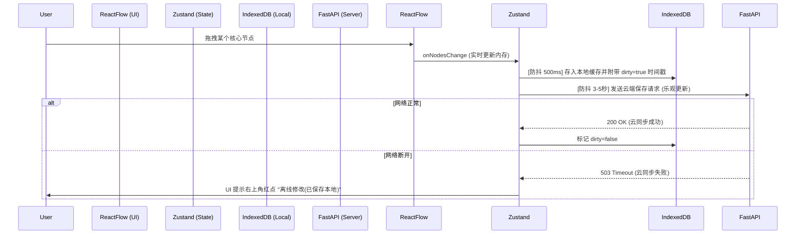

# 工作流画布：编辑器同步与自动保存策略

> 本文档用于定义 `StudySolo` 中关于 React Flow 工作流画布的自动保存、离线缓存机制以及数据冲突解决策略。

## 1. 业务场景需求总结

根据前期分析，对于工作流画布功能，我们需要满足以下交互体验：

1. **登录前置**：进入应用前必须完成登录身份验证。
2. **首次同步**：登录后首先从云端同步所有归属用户的工作流数据并进行懒加载（即：列表优先，具体画布数据在用户点击打开时才拉取）。
3. **心跳检测与自动保存**：
   - 用户打开特定画布时，画布数据先存放在本地存储（`localStorage` 或 `IndexedDB`）。
   - 设置心跳机制，检测用户与服务器的连接状态（如每隔 3-5 秒）。
   - 如果网络保持连接，则静默地将当前画布内容变化同步（Patch）到云端。
4. **中断拦截（防丢机制）**：
   - 监听浏览器标签页关闭、刷新或主动退出某画布的事件。
   - 触发时提供拦截确认弹窗（“未保存的更改即将丢失，是否保存？”），模拟类似 WPS、Figma 等软件的体验。
5. **异常断开数据恢复**：
   - 如果用户设备突然断电或断网，最新的画布节点状态仅存在于本地。
   - 当用户再次进入画布时，检查本地缓存的时间戳是否晚于云端存储的最后修改时间戳。
   - 若存在较新的本地数据，则弹窗提示：“检测到上次有异常离开的未同步数据，是否恢复并同步至云端？”。

---

## 2. 业界主流解决方案预研

为了实现上述体验，特别是防丢与异常恢复，我们检索了基于 React Flow 场景下“离线优先 (Offline-First)”和“同步冲突策略”的最佳实践：

### 2.1 状态双向同步与管理 (CRDT vs OT)

大型协作图表工具通常使用 **CRDT (Conflict-free Replicated Data Types)** 或 **OT (Operational Transformation)**。对于当前“单人编辑为主，重度防丢体验”的独立应用，**直接上 CRDT 过重且开发成本高**，但结合一些 CRDT 的思想非常有助于管理状态。

建议采用：**乐观更新 (Optimistic Update) + 本地重型缓存 (Local-First)** 模型。
结合技术栈特点：
- 前端使用 `Zustand` 作为内存态主脑：接管 React Flow 的 `[nodes, edges]`。
- 本地使用 `IndexedDB` (或 `localforage`，比 `localStorage` 更适合存 MB 级别的 JSON，防阻塞主线程) 作为兜底。
- 后端使用 `FastAPI` + `Supabase` 作为云端真理之源 (Source of Truth)。

### 2.2 防抖策略 (Debounce Strategy)

不可每次 Node 移动 1 像素都发请求，这会打满服务器与数据库：

- **UI 层**：React Flow 内的操作是**实时**同步到 Zustand 并重绘的（0 延迟）。
- **本地存储层 (IndexedDB)**：使用**高频防抖**（如 500ms 不操作时写入本地）。
- **云端同步层 (API Sync)**：使用**低频防抖**（如 3-5s 没操作时自动发 PUT 请求到后端）；由于是全量或差异化的 JSONB，此举可以节省极大带宽。

---

## 3. 具体实施方案 (Architecture Design)

### 3.1 状态转换流程机制



### 3.2 拦截用户离开与异常状态检测

#### A. 预防正常离开时的丢失 (`window.onbeforeunload`)

借助于原生的弹窗或 Next.js Router 守卫结合脏数据标记：

```javascript
// 在 Zustand store 中维护一个 isDirty 状态
useEffect(() => {
  const handleBeforeUnload = (e) => {
    const isDirty = useWorkflowStore.getState().isDirty;
    if (isDirty) {
      // 大部分现代浏览器只能展示默认系统弹窗文案
      e.preventDefault();
      e.returnValue = ''; // 触发弹窗
    }
  };
  window.addEventListener('beforeunload', handleBeforeUnload);
  return () => window.removeEventListener('beforeunload', handleBeforeUnload);
}, []);
```

对于从“工作流 A”切换到“主页”这种单页路由跳转，使用 `next/navigation` 或 `next/router` 拦截器并弹出自定义弹窗询问“是否保存并覆盖云端”。

#### B. 异常中断（断网/浏览器崩溃）的二次恢复补偿逻辑

**流程：**
1. 每次同步到 IndexedDB 时生成一个 `local_updated_at`。
2. 每次收到云端 FastAPI 正确反馈时保存 `cloud_updated_at`。
3. 下次用户加载该工作流时（懒加载流程启动）：
   - 请求 API 获取记录（含有 `cloud_updated_at`）。
   - 同时查询 IndexedDB 里的此 `workflow_id`。
   - 如果 `local_updated_at` 明显大于 `cloud_updated_at`，说明上次发生崩溃。
4. 此时先渲染 IndexedDB 的数据并打上蒙层，弹窗问用户：“系统检测到上次由于异常退出有未保存的操作记录（时间: xxx），是否恢复并进行云端覆盖？”。
    - 点击「恢复并同步」：使用本地数据立刻发 PUT 请求进行覆盖。
    - 点击「丢弃」：清空此 IndexedDB 记录，使用云端拉取的数据重新渲染。

---

## 4. 前端底层选型收敛建议

1. 改换本地存储：弃用 `localStorage`（5MB 上限且同步阻塞），改用库 **`localforage`** （背后用 IndexedDB，支持 Promise 异步，支持存储极大的画布 JSONB 且性能好）。
2. 网络请求态：使用 **`SWR`** 或 **`React Query`**，结合它们自带的 Optimistic Update (乐观更新) 方案极其优秀，能无缝处理失败回滚逻辑。
3. React Flow Hook 管理：写一个独立的 `useWorkflowSync` 自定义 Hook 封装 Zustand、localforage 和 Fetch 逻辑。保证 UI 组件只负责渲染。
