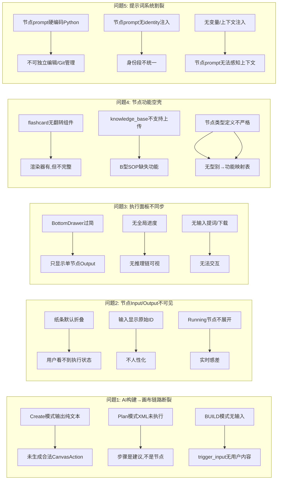

# [已完成] 🔬 工作流节点系统性问题深度分析与整改规划

> **状态**：已完成。本文档覆盖的 Phase 0 到 Phase 4 核心修复工作均已落地。下一阶段的增强计划已转移至 `node_system_next_phase_debt_and_planning.md`。
> **分析时间**: 2026-03-27 (v2 更新: 14:34)  
> **分析范围**: 左侧AI构建 → 画布节点 → 右侧执行面板 → 节点功能完整性 → **提示词系统架构**  
> **分析依据**: SOP文档 + 源码 + 用户截图 + 近期对话记录

---

## 0. 事实源优先级（实施时必须服从）

本文件是整改规划文档，不高于真实代码与当前工程基线。实施与后续同步必须按以下顺序判断事实：

1. [`docs/README.md`](/D:/project/Study_1037Solo/StudySolo/docs/README.md)
2. [`docs/summary/current-engineering-baseline.md`](/D:/project/Study_1037Solo/StudySolo/docs/summary/current-engineering-baseline.md)
3. [`docs/项目规范与框架流程/项目规范/项目架构全景.md`](/D:/project/Study_1037Solo/StudySolo/docs/项目规范与框架流程/项目规范/项目架构全景.md)
4. [`docs/项目规范与框架流程/项目规范/frontend-engineering-spec.md`](/D:/project/Study_1037Solo/StudySolo/docs/项目规范与框架流程/项目规范/frontend-engineering-spec.md)
5. [`docs/项目规范与框架流程/功能流程/新增AI工具/00-节点与插件分类判断.md`](/D:/project/Study_1037Solo/StudySolo/docs/项目规范与框架流程/功能流程/新增AI工具/00-节点与插件分类判断.md)
6. [`docs/项目规范与框架流程/功能流程/新增AI工具/A型-LLM提示词节点-SOP.md`](/D:/project/Study_1037Solo/StudySolo/docs/项目规范与框架流程/功能流程/新增AI工具/A型-LLM提示词节点-SOP.md)
7. [`docs/项目规范与框架流程/功能流程/新增AI工具/B型-外部工具节点-SOP.md`](/D:/project/Study_1037Solo/StudySolo/docs/项目规范与框架流程/功能流程/新增AI工具/B型-外部工具节点-SOP.md)
8. [`docs/项目规范与框架流程/功能流程/新增AI工具/执行面板升级规划.md`](/D:/project/Study_1037Solo/StudySolo/docs/项目规范与框架流程/功能流程/新增AI工具/执行面板升级规划.md)

---

## 一、五大核心问题定位

### 📊 问题全景图



---

## 二、问题1：左侧AI构建节点与画布链路断裂

### 2.1 根因分析

系统有 **4种AI生成模式**，链路逻辑完全不同，但存在以下致命缺陷：

| 模式 | 触发条件 | 当前实现 | 核心Bug |
|------|----------|----------|---------|
| **BUILD** (从0到1) | 空画布 + 学习类描述 | [ai.py L232-384](file:///d:/project/Study_1037Solo/StudySolo/backend/app/api/ai.py#L232-384) 2阶段调用 → `replaceWorkflowGraph` | ✅ 链路完整，但 `trigger_input` 的 label 是用户输入截取，**没有绑定 user_content 到 data 中**，导致执行时无法传递原始输入给下游 |
| **MODIFY** (添加/修改节点) | `mode='create'` + 有画布 | [ai_chat_stream.py L73-150](file:///d:/project/Study_1037Solo/StudySolo/backend/app/api/ai_chat_stream.py#L73-L150) → CanvasAction | ⚠️ AI 有时不遵循 JSON 格式，返回纯文本（如截图所示"一行字"），前端 `handleModifyIntent` [use-stream-chat.ts L127-143](file:///d:/project/Study_1037Solo/StudySolo/frontend/src/features/workflow/hooks/use-stream-chat.ts#L127-L143) 的 `JSON.parse` 失败后直接显示原文 |
| **PLAN** (规划模式) | `mode='plan'` | 输出 XML → [parse-plan-xml.ts](file:///d:/project/Study_1037Solo/StudySolo/frontend/src/features/workflow/utils/parse-plan-xml.ts) 解析 | ❌ Plan 模式**只生成建议文本**，没有任何代码路径将 `PlanStep.nodeType` + `PlanStep.action` 转化为实际的 `CanvasAction` 并执行！Plan 解析结果只在聊天面板展示，从未连接到 `executeCanvasActions` |
| **CHAT** (纯对话) | 默认模式 | 流式输出文本 | ✅ 设计如此，无Bug |

### 2.2 具体 Bug 清单

#### Bug 1.1: MODIFY 模式 AI 输出格式不稳定 → 画布显示纯文本

**问题路径**:
```
用户输入 "加一个闪卡节点"
→ ai_chat_stream.py mode='create' → AI 调用 get_create_prompt
→ AI 有时返回自然语言（不遵循 JSON tool_calls 格式）
→ 前端 handleModifyIntent → JSON.parse 失败 → catch → return rawJson
→ 聊天面板显示一行原始文本，画布无任何变化
```

**根因**: 
- [mode_create.md](file:///d:/project/Study_1037Solo/StudySolo/backend/app/prompts/mode_create.md) 的 prompt 约束不够强，AI（特别是较弱模型）经常违反 JSON-only 输出要求
- [ai_chat_stream.py L118](file:///d:/project/Study_1037Solo/StudySolo/backend/app/api/ai_chat_stream.py#L118) 的 `_extract_json_obj` 提取失败时没有 fallback/retry
- 前端 [use-stream-chat.ts L141](file:///d:/project/Study_1037Solo/StudySolo/frontend/src/features/workflow/hooks/use-stream-chat.ts#L141) parse 失败就 `return rawJson`，用户看到的就是"一行文字"

#### Bug 1.2: Plan 模式解析结果从未执行到画布

**问题路径**:
```
用户选择 Plan 模式 → AI 生成 XML
→ parsePlanResponse() 解析出 PlanStep[]
→ UI 展示建议列表（带勾选框 selected）
→ ❌ 没有 "确认执行" 按钮/动作
→ ❌ 没有代码将 PlanStep 转换为 CanvasAction
→ Plan 建议永远停留在聊天面板，无法执行到画布
```

**根因**: Plan → Execute 的桥梁完全缺失。`parsePlanResponse` 只做了解析，没有后续的 execute path。

#### Bug 1.3: BUILD 模式生成的 trigger_input 没有传递输入

**问题路径**:
```
BUILD → ai.py → 生成 trigger_input 节点
→ trigger_input.data.label = user_input[:80]（仅截取显示用）
→ 执行时引擎读取 trigger_input 的 user_content → 空！
→ 下游节点的 upstream_outputs 为空
→ 整个工作流无有效输入
```

**根因**: [ai.py L348](file:///d:/project/Study_1037Solo/StudySolo/backend/app/api/ai.py#L348) 只设了 `label`，没有同时设置 `data.user_content` 或等效字段来传递给执行引擎。

### 2.3 修复方案

| Bug | 优先级 | 修复方案 | 涉及文件 |
|-----|--------|----------|----------|
| 1.1 MODIFY格式不稳定 | 🔴 P0 | ① 后端 `_extract_json_obj` 失败时加 retry（同 `_call_with_retry` 逻辑）<br>② `mode_create.md` 强化 few-shot 示例<br>③ 前端 parse 失败时显示错误提示而非原文 | `ai_chat_stream.py`, `mode_create.md`, `use-stream-chat.ts` |
| 1.2 Plan未执行到画布 | 🔴 P0 | ① 在 Plan UI 添加"一键执行选中步骤"按钮<br>② 新增 `planStepsToActions()` 转换函数<br>③ 复用 `executeCanvasActions` 执行 | 新增 `plan-executor.ts`, 修改 Plan UI 组件 |
| 1.3 BUILD缺输入 | 🟡 P1 | ① `ai.py` 中 trigger_input 的 data 同时设置 `user_content: body.user_input`<br>② 前端 `replaceWorkflowGraph` 后将 userInput 写入 trigger 节点 | `ai.py`, `use-stream-chat.ts` |

---

## 三、问题2：节点Input/Output展示（"纸条"机制）

### 3.1 根因分析

当前 [NodeResultSlip.tsx](file:///d:/project/Study_1037Solo/StudySolo/frontend/src/features/workflow/components/nodes/NodeResultSlip.tsx) 存在以下不足：

| 缺陷 | 现状 | 扣子平台标准 |
|------|------|-------------|
| 默认状态 | pending 时显示极小的"闲置中"标签 | 应清晰显示"等待执行"+ 节点类型说明 |
| Running自动展开 | ❌ 不自动展开 | ✅ 执行中自动展开，实时追加token |
| Done后保持展开 | ❌ 需手动展开 | ✅ 从running→done保持展开状态 |
| 上游ID显示 | 显示 `[abc123]` 原始ID | 应显示"来自 {上游节点名称}" |
| 输入区域 | 有，但显示 `[uid.slice(0,6)]` | 应显示完整名称 + 可读摘要 |
| 输出区域 | 有渲染器但 compact 模式缺失 | 面板中应有精简模式 |

### 3.2 修复方案

**已有详细规划**: [执行面板升级规划.md 六-6.1](file:///d:/project/Study_1037Solo/StudySolo/docs/项目规范与框架流程/功能流程/新增AI工具/执行面板升级规划.md) 已覆盖此部分改造，具体需要：

1. **上游 ID → 名称映射** — 从 `useWorkflowStore.nodes` 构建 `nodeNameMap`
2. **Running 自动展开** — `useEffect` 监听 `status === 'running'` → `setIsExpanded(true)`
3. **Done 保持展开** — `wasRunningRef` 防止 running→done 自动收起
4. **NodeRendererProps 加 compact** — 所有渲染器支持精简模式

---

## 四、问题3：右侧执行面板不同步

### 4.1 根因分析

当前执行面板是一个简陋的 [BottomDrawer.tsx](file:///d:/project/Study_1037Solo/StudySolo/frontend/src/features/workflow/components/panel/BottomDrawer.tsx)，**只有106行代码**，功能极其有限：

| 缺陷 | 严重程度 | 说明 |
|------|----------|------|
| 只显示单节点 | 🔴 致命 | 只展示 `selectedNodeId` 的数据，无全局执行视图 |
| 无输入词提示 | 🔴 致命 | 用户无法在面板输入/编辑节点的输入提示词 |
| 无下载按钮 | 🟡 重要 | 执行完成后无法下载输出内容 |
| 卡片式布局 | 🟡 重要 | 应改为推理链式（时间轴 + 步骤序列） |
| 无进度条 | 🟡 重要 | 无法看到 "N/M 步骤完成" |
| 无流式追加 | 🔴 致命 | 面板只读取最终 output，不支持流式token显示 |
| 无错误详情 | 🟡 重要 | 失败节点没有结构化错误展示 |

### 4.2 修复方案

**已有完整规划文档**: [执行面板升级规划.md](file:///d:/project/Study_1037Solo/StudySolo/docs/项目规范与框架流程/功能流程/新增AI工具/执行面板升级规划.md) (873行) 已覆盖全部设计，包含：

- **数据层**: `NodeExecutionTrace` + `WorkflowExecutionSession` 类型
- **Store层**: `executionSession` + 5个action方法
- **Hook层**: `use-workflow-execution.ts` SSE事件叠加trace更新
- **UI层**: 7个全新组件（ExecutionTraceDrawer → TraceStepItem → ...）

但规划中**缺失**以下内容需补充：

| 缺失项 | 说明 |
|--------|------|
| 输入提示词编辑 | 用户应能在面板中编辑节点的 `user_content`，类似扣子的"输入区" |
| 输出下载按钮 | 完成后应有"下载为 .md / .json / .txt"按钮 |
| 从面板触发单节点执行 | 用户编辑输入后应能点击"运行此节点" |

---

## 五、问题4：部分节点功能空壳

### 5.1 节点功能完整性审计

基于 [workflow-meta.ts](file:///d:/project/Study_1037Solo/StudySolo/frontend/src/features/workflow/constants/workflow-meta.ts) 的20个节点类型 + [RENDERER_REGISTRY](file:///d:/project/Study_1037Solo/StudySolo/frontend/src/features/workflow/components/nodes/index.ts) + [后端 nodes/ 目录](file:///d:/project/Study_1037Solo/StudySolo/backend/app/nodes)：

| 节点类型 | SOP型 | 前端渲染器 | 后端实现 | 功能完整度 | 具体缺陷 |
|----------|-------|-----------|---------|-----------|----------|
| `trigger_input` | — | ✅ Passthrough | ✅ input/ | ⚠️ 70% | 只传递label，不传递user_content |
| `ai_analyzer` | A2 | ✅ JsonRenderer | ✅ analysis/ | ✅ 90% | — |
| `ai_planner` | A2 | ✅ JsonRenderer | ✅ analysis/ | ✅ 90% | — |
| `outline_gen` | A1 | ✅ OutlineRenderer | ✅ generation/ | ✅ 90% | — |
| `content_extract` | A1 | ✅ MarkdownRenderer | ✅ generation/ | ✅ 90% | — |
| `summary` | A1 | ✅ MarkdownRenderer | ✅ generation/ | ✅ 90% | — |
| `flashcard` | A1 | ⚠️ FlashcardRenderer | ✅ generation/ | ⚠️ 60% | 翻转动画有，但**无 Anki 导出、无间隔重复、无学习进度追踪**。渲染器只有基础Q&A翻转，距离"闪卡组件"差距大 |
| `chat_response` | A1 | ✅ MarkdownRenderer | ✅ interaction/ | ✅ 90% | — |
| `write_db` | B | ✅ Passthrough | ✅ output/ | ⚠️ 50% | 需验证实际写入逻辑是否连接了Supabase |
| `compare` | A1 | ✅ CompareRenderer | ❓ 待验证 | ⚠️ 50% | 渲染器存在，但后端节点实现未确认 |
| `mind_map` | A1 | ✅ MindMapRenderer | ❓ 待验证 | ⚠️ 50% | 同上 |
| `quiz_gen` | A1 | ✅ QuizRenderer | ✅ generation/ | ⚠️ 70% | 渲染器有完整交互（3个文件），但后端测验评分/保存缺失 |
| `merge_polish` | A1 | ✅ MarkdownRenderer | ❓ 待验证 | ⚠️ 50% | — |
| `knowledge_base` | B | ✅ MarkdownRenderer | ✅ input/ | ❌ 30% | **不支持文件上传**！只支持文本检索，无 embedding 存储、无文件解析 |
| `web_search` | B | ✅ MarkdownRenderer | ❓ 待验证 | ⚠️ 50% | 渲染器用 Markdown，但后端 Tavily/搜索服务连接待验证 |
| `export_file` | B | ✅ ExportRenderer | ❓ 待验证 | ⚠️ 40% | 渲染器存在但实际文件生成/下载逻辑未确认 |
| `logic_switch` | — | ✅ JsonRenderer | ❓ | ⚠️ 30% | 条件分支引擎逻辑未确认 |
| `loop_map` | — | ✅ JsonRenderer | ❓ | ⚠️ 30% | 循环引擎逻辑未确认 |
| `loop_group` | — | (group容器) | ❓ | ⚠️ 30% | 容器组逻辑未确认 |

### 5.2 关键空壳解析

#### 空壳1: `flashcard` — 有渲染器但功能单薄

当前 [FlashcardRenderer.tsx](file:///d:/project/Study_1037Solo/StudySolo/frontend/src/features/workflow/components/nodes/renderers/FlashcardRenderer.tsx) 只有76行，实现了：
- ✅ JSON 解析 `[{question, answer}]`
- ✅ 点击翻转动画
- ❌ **无间隔重复算法** (SM-2 / Anki 标准)
- ❌ **无学习进度追踪**
- ❌ **无 Anki 导出 (.apkg)**
- ❌ **无批量操作 (全部翻转/洗牌)**

#### 空壳2: `knowledge_base` — 不支持文件上传

knowledge_base 节点当前的定义是 `requiresModel: false`（B型工具节点），但：
- ❌ 前端**没有文件上传组件** — 用 `MarkdownRenderer` 渲染搜索结果
- ❌ 后端**缺少文件解析服务** (pypdf, python-docx)
- ❌ 缺少 **embedding 存储/检索** 完整链路
- ❌ 缺少 **文件管理 UI** (已上传文件列表、删除)

#### 空壳3: 节点 `type ↔ 实际功能` 映射缺失

**没有一个权威文档定义每个节点"应该做什么"**。`workflow-meta.ts` 只定义了 UI 元信息（label, icon, description），但不包含：
- 该节点属于什么 SOP 类型 (A1/A2/B/C)
- 该节点的核心功能清单
- 该节点必须安装的组件
- 该节点的验收标准

---

## 五-B、问题5：提示词系统架构割裂

### 5B.1 现状：两套独立的提示词系统

当前项目存在 **两套完全脱节的提示词系统**，这是根本性的架构问题：

| 对比 | 系统A: 对话面板 (Chat/Create/Plan) | 系统B: 节点执行引擎 |
|------|----------------------------------|---------------------|
| 存储 | `.md` 文件 (`prompts/identity.md`, `mode_*.md`) | Python `dict` 硬编码 (`models/ai.py` L61-136) |
| 身份注入 | ✅ `identity.md` 自动前缀 | ❌ **无身份段** |
| 变量系统 | ✅ `{{var}}` 占位符 + `_render()` | ❌ 无变量系统 |
| 缓存 | ✅ `@lru_cache` | N/A (内存常驻) |
| 可维护性 | ⭐⭐⭐⭐ Git友好 | ⭐ 改prompt要改Python |
| 上下文感知 | ✅ `{{canvas_context}}` | ❌ 无法注入执行上下文 |

### 5B.2 具体问题

- **问题 5.1**: [models/ai.py L61-136](file:///d:/project/Study_1037Solo/StudySolo/backend/app/models/ai.py#L61-L136) 中 11 个节点prompt全是Python字符串，修改需改Python+重启
- **问题 5.2**: 节点执行时AI收到的prompt**没有任何身份信息**，安全规则未生效
- **问题 5.3**: 节点prompt完全静态，无法注入暗线上下文或上游摘要

### 5B.3 目标架构：统一三段式提示词系统

```
统一后的提示词拼接流程:
┌─────────────────────────────────────────────────┐
│ [1. 固定身份段]  ← prompts/identity.md          │ 始终注入
│ [2. 模式/节点段] ← prompts/mode_*.md            │ 对话面板
│                   prompts/nodes/*.md            │ 节点执行
│ [3. 动态上下文段] ← 运行时拼接                   │ implicit_context等
│ [4. 用户输入段]  ← messages[-1]                 │
└─────────────────────────────────────────────────┘
```

### 5B.4 迁移设计（按真实基线修正）

#### 真实落地目录结构

```
backend/app/
├── prompts/
│   ├── identity.md
│   ├── mode_chat.md / mode_create.md / mode_plan.md
│   └── prompt_loader.py               ← 继续负责对话模式 prompt
└── nodes/
    ├── _base.py                       ← BaseNode.system_prompt 统一装配入口
    ├── _base_prompt.md                ← 节点通用执行规则
    ├── analysis/*/prompt.md
    ├── generation/*/prompt.md
    ├── input/*/prompt.md
    ├── interaction/*/prompt.md
    └── output/*/prompt.md             ← 节点级提示词与节点实现同目录
```

#### 当前真实结论

- `BaseNode.system_prompt` 已统一拼接 `identity.md + nodes/_base_prompt.md + 各节点目录 prompt.md`
- BUILD 链路通过 `BaseNode.get_system_prompt_for_type()` 读取节点提示词
- `prompt_loader.py` 保留，但只负责 `mode_chat / mode_create / mode_plan / intent_classifier`
- 因此 **P0A 已完成，但实现路径不是旧草案中的 `prompt_loader.py + prompts/nodes/*.md`**

#### 节点 `prompt.md` 模板规范

每个 `nodes/*.md` 文件遵循统一格式：

```markdown
# {节点中文名} — {英文角色}

你当前作为 **{角色名}** 执行工作流节点任务。

## 任务目标
{该节点的核心目标，1-2 句}

## 输入
你会收到以下输入：
- **上游输出**: 来自工作流上游节点的输出内容
- **暗线上下文**: {{implicit_context}}

## 输出格式 (CRITICAL)
{严格定义：Markdown / JSON / JSON数组}
{必须包含字段说明和示例}

## 质量标准
{该节点特有的输出质量要求}
```

### 5B.5 新增节点的 prompt 流程 (SOP 扩展)

迁移完成后，新增节点步骤：
1. 按分类在 `backend/app/nodes/<category>/<node_type>/` 新建 `prompt.md`
2. 在对应 `node.py` 中继承 `BaseNode`
3. 按 A/B 型 SOP 更新 `config.yaml`、前端注册与 `compact` 渲染
4. ✅ 完成！节点提示词不再依赖硬编码 Python 字典

---

## 六、整体修复优先级与顺序规划

### 6.1 优先级矩阵

```
                    影响面大 ────────────────→
                    │                        │
    紧急 ──────→    │ P0: AI链路 + 提示词    │ P1: 执行面板升级
                    │ (不修=完全不可用)      │ (不修=体验差)
                    │                        │
                    │ P2: 节点纸条改造       │ P3: 节点空壳补全
    不紧急 ────→    │ (UX优化)              │ (功能扩展)
                    │                        │
```

### 6.2 推荐执行顺序

```
═══════════════════════════════════════════════════════════════
Phase 0A: 提示词系统统一 ✅ 已完成（以真实基线为准）
═══════════════════════════════════════════════════════════════

  ✦ 真实目标: 将两套提示词系统合一，并收敛到 `BaseNode + prompt.md`

  Step 0A.1  删除 `models/ai.py` 中硬编码 `SYSTEM_PROMPTS`

  Step 0A.2  在 `backend/app/nodes/_base.py` 实现统一装配
             → `identity.md + nodes/_base_prompt.md + 各节点 prompt.md`

  Step 0A.3  将节点提示词迁移到各节点目录下的 `prompt.md`
             → 与节点实现同目录，遵循 A/B 型 SOP

  Step 0A.4  BUILD 链路改为通过 `BaseNode.get_system_prompt_for_type()` 取系统提示词

  Step 0A.5  回归验证
             → BUILD 生成工作流时可正确注入节点系统提示词
             → 节点执行时可统一注入 identity 与通用执行规则

═══════════════════════════════════════════════════════════════
Phase 0B: 紧急修复 — AI→画布链路（首版已落地，待持续回归）
═══════════════════════════════════════════════════════════════

  Step 0B.1  强化 mode_create.md 格式约束 + few-shot
             → 删除 ```json 包裹的示例（AI容易连同输出```）
             → 添加 3 个完整的 few-shot 输入→输出示例
             → 添加 "绝对禁止" 负面示例
             → 添加 "你的完整输出从第1字符起必须是{" 强约束

  Step 0B.2  后端 MODIFY 链路加固
             → ai_chat_stream.py: _extract_json_obj 失败时
               加 retry (复用 _call_with_retry 逻辑)
             → 最多重试 2 次，每次附带格式纠错指令

  Step 0B.3  前端 parse 失败处理
             → use-stream-chat.ts: parse 失败时显示结构化
               错误提示 + "重试" 按钮，而非显示原文

  Step 0B.4  修复 BUILD 模式 trigger_input 输入缺失
             → ai.py L348: trigger_node.data 添加
               user_content=body.user_input
             → 前端 handleBuildIntent 后同步写入

  Step 0B.5  实现 Plan → Execute 桥梁
             → 新增 plan-executor.ts
             → Plan UI 添加 "执行选中步骤" 按钮
             → 复用 executeCanvasActions()

═══════════════════════════════════════════════════════════════
Phase 1: 数据层 — 执行追踪基础设施（首版已落地）
═══════════════════════════════════════════════════════════════

  Step 1.1  types/workflow.ts 新增 NodeExecutionTrace, WorkflowExecutionSession
  Step 1.2  新增 utils/trace-helpers.ts
  Step 1.3  use-workflow-store.ts 新增 executionSession + 5个 action
  Step 1.4  use-workflow-execution.ts SSE事件叠加 trace 更新调用

═══════════════════════════════════════════════════════════════
Phase 2: 画布纸条改造 — NodeResultSlip 升级（首版已落地）
═══════════════════════════════════════════════════════════════

  Step 2.1  上游 ID → 节点名称映射 (nodeNameMap from store)
  Step 2.2  Running 自动展开 + Done 保持展开
  Step 2.3  NodeRendererProps 新增 compact prop
  Step 2.4  各渲染器实现 compact 精简展示

═══════════════════════════════════════════════════════════════
Phase 3: 执行面板升级 — 推理链式替代卡片式（首版已落地）
═══════════════════════════════════════════════════════════════

  Step 3.1  TraceStepInput.tsx (输入展示, ID→名称映射)
  Step 3.2  TraceStepOutput.tsx (输出展示, compact 渲染器)
  Step 3.3  TraceStepItem.tsx (单步骤推理链条目)
  Step 3.4  TraceParallelGroup.tsx (并行组分叉)
  Step 3.5  ExecutionTraceList.tsx (推理链列表)
  Step 3.6  ExecutionProgressHeader.tsx (进度条 + 耗时)
  Step 3.7  ExecutionTraceDrawer.tsx (主抽屉容器)
  Step 3.8  替换 BottomDrawer → ExecutionTraceDrawer
  Step 3.9  面板增加: 输入提示词编辑 + 输出下载按钮

═══════════════════════════════════════════════════════════════
Phase 4: 节点功能补全 — 按优先级逐个修复 (预计 3-5 天)
═══════════════════════════════════════════════════════════════

  Step 4.1  建立「节点功能规格表」— 每个节点的 SOP 类型 + 必须功能
  Step 4.2  补全 knowledge_base: 文件上传 + 解析 + embedding 链路
  Step 4.3  增强 flashcard: 间隔重复 + 进度追踪 + 导出
  Step 4.4  验证并补全: compare, mind_map, web_search, export_file 后端实现
  Step 4.5  验证控制流: logic_switch, loop_map, loop_group 引擎完整性

═══════════════════════════════════════════════════════════════
Phase 5: SOP 文档同步更新 (贯穿所有 Phase)
═══════════════════════════════════════════════════════════════

  Step 5.1  A型 SOP 补充 compact 规范 + 面板验收步骤
  Step 5.2  B型 SOP 补充错误信息双视图规范  
  Step 5.3  新增「节点功能规格表」文档
  Step 5.4  更新 project-context SKILL.md 的节点体系说明
  Step 5.5  新增「新节点 prompt 编写指南」(引用 nodes/*.md 模板)
```

---

## 七、各Phase改动文件清单

### Phase 0A (提示词系统统一，真实落地版)

| # | 文件 | 类型 | 说明 |
|---|------|------|------|
| 1 | `backend/app/nodes/_base.py` | 改造 | `BaseNode.system_prompt` 统一装配入口 |
| 2 | `backend/app/nodes/_base_prompt.md` | **新增** | 节点通用执行规则片段 |
| 3 | `backend/app/nodes/**/prompt.md` | **新增/迁移** | 各节点目录下独立提示词 |
| 4 | `backend/app/models/ai.py` | 改造 | 删除 `SYSTEM_PROMPTS` dict |
| 5 | `backend/app/prompts/prompt_loader.py` | 保留 | 继续负责对话模式 prompt 装配，不负责节点 prompt |

### Phase 0B (AI→画布链路修复)

| # | 文件 | 类型 | 说明 |
|---|------|------|------|
| 1 | `backend/app/prompts/mode_create.md` | 改造 | 强化格式约束 + 3个 few-shot + 负面示例 |
| 2 | `backend/app/api/ai_chat_stream.py` | 改造 | L111-118 添加JSON验证重试 |
| 3 | `frontend/src/features/workflow/hooks/use-stream-chat.ts` | 改造 | L127-143 parse失败→错误提示+重试 |
| 4 | `backend/app/api/ai.py` | 改造 | L348 trigger_input 加 user_content |
| 5 | `frontend/src/features/workflow/utils/plan-executor.ts` | **新增** | PlanStep → CanvasAction 转换 |
| 6 | Plan UI组件 | 改造 | 添加执行按钮 |

### Phase 1-3 (执行追踪+面板)

按照 [执行面板升级规划.md](file:///d:/project/Study_1037Solo/StudySolo/docs/项目规范与框架流程/功能流程/新增AI工具/执行面板升级规划.md) 第八节的 22个文件清单执行,额外新增 3个文件:
- 输入编辑组件
- 输出下载组件  
- 面板入口改造

### Phase 4 (节点补全)

按实际审计结果逐节点补全，每个节点严格走对应 SOP (A/B/C型)。

---

## 八、风险评估

| 风险 | 描述 | 缓解措施 |
|------|------|----------|
| AI 格式稳定性 | 即使加了 retry，弱模型仍可能不遵循 | 限制 MODIFY 模式只使用能力强的模型；增加前端"手动添加节点"入口作为 fallback |
| 提示词迁移回归 | 节点prompt从Python迁移到.md后输出质量可能变化 | 逐节点迁移+回归测试，不一次性全迁 |
| 执行面板性能 | 20+ 节点的工作流, trace 数据量大 | React.memo + 虚拟滚动 + immer 优化 store |
| knowledge_base 改造范围 | 文件上传涉及 Supabase Storage + embedding | 分阶段: 先支持文本粘贴, 再支持文件上传 |
| 向后兼容 | NodeRendererProps 加 compact 要更新所有渲染器 | compact 设为可选 `compact?: boolean`，不传时行为不变 |
| identity.md 膨胀 | 节点执行也注入identity后prompt更长 | 可按需裁剪: 节点执行时只注入身份+安全段, 不注入节点类型表 |

---

> 📌 **核心结论**: 五大问题中，**Phase 0A（提示词统一）已按真实基线完成**，当前最紧急的 P0 是 **Phase 0B（AI→画布链路修复）**。在此基础上，再推进 Phase 1-3 的执行追踪与面板升级，最后进入 Phase 4 的节点能力补全。

---

## 九、提示词系统后续扩展路线

完成 Phase 0A 后，当前真实基线下的统一 `.md` 体系为以下扩展奠定基础：

| 扩展方向 | 实现方式 | 优先级 |
|----------|----------|--------|
| **新节点只加 prompt.md** | 新节点按分类新建 `backend/app/nodes/<category>/<type>/prompt.md`，并复用 `BaseNode.system_prompt` | ✅ Phase 0A 完成即可 |
| **暗线上下文注入** | 节点 `.md` 中 `{{implicit_context}}` 由引擎运行时填充 | Phase 1 可启用 |
| **A/B 测试** | 同一节点多个 `.md` 版本 + 路由策略 | 后期 |
| **多语言** | `nodes/outline_gen.md` → `nodes/outline_gen.en.md` | 后期 |
| **Prompt 版本化** | `.md` 文件 Git history 天然支持 | ✅ 免费获得 |
