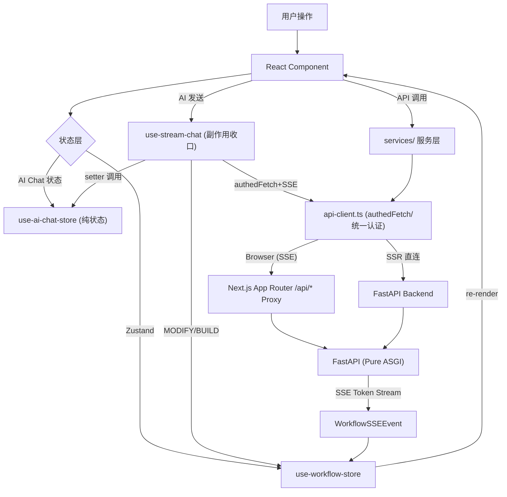
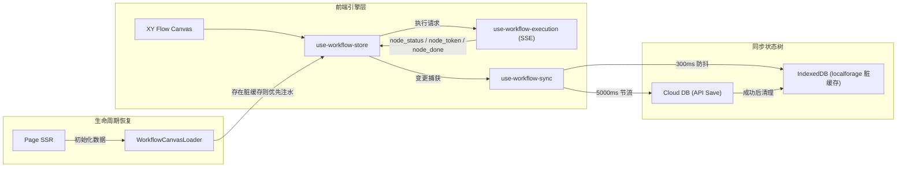
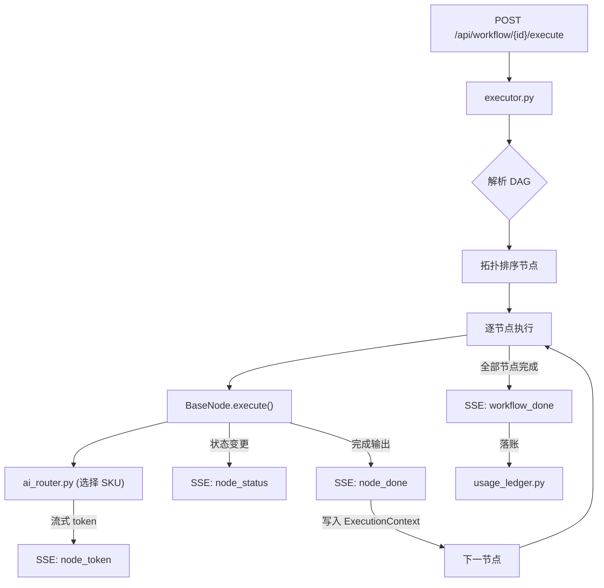
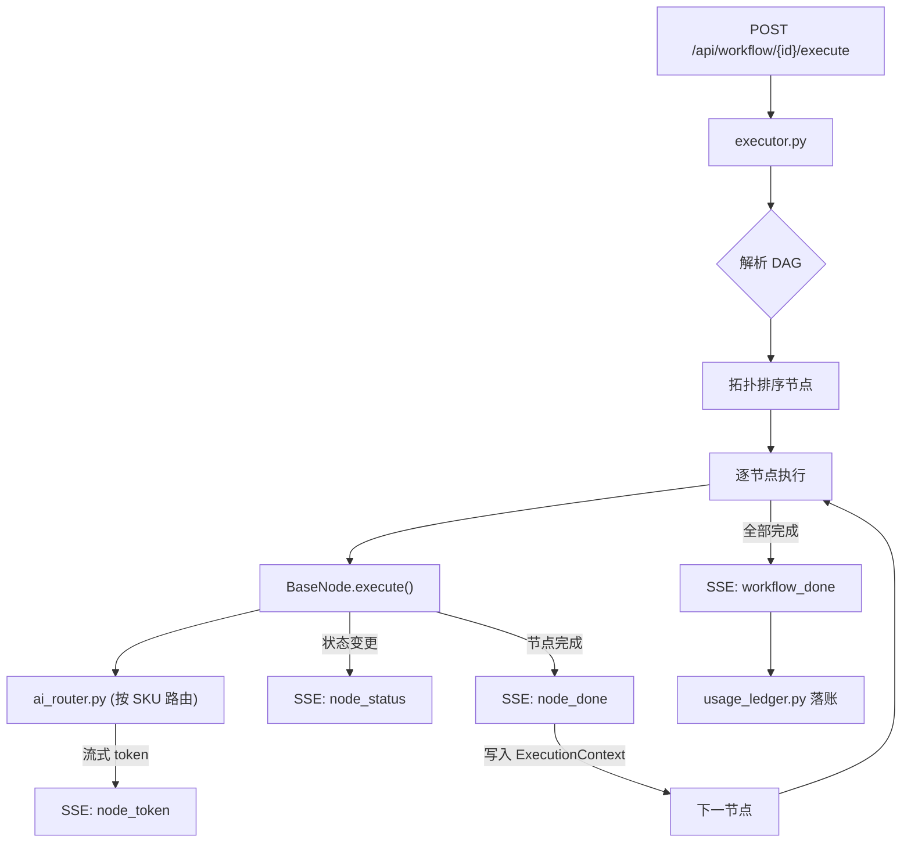
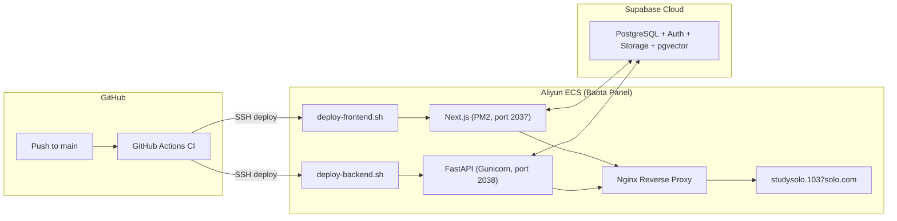

# StudySolo 项目架构全景

> **最后更新**: 2026-03-26 · 全面同步工作流协作系统、公开分享双路由、AI Catalog SKU 计费体系、知识库向量检索、Admin 完整化；本次同步补充 Store 副作用剥离重构（2026-03-26 23:55）
> **事实源**: `frontend/package.json`、`backend/requirements.txt`、`backend/app/api/router.py`、`frontend/src/types/workflow.ts`、`backend/config.yaml`、`supabase/migrations/*`、`.gitmodules`

---

## 一、项目定位

StudySolo 是 1037Solo 生态旗下的 **AI 学习工作流引擎平台**。用户在可视化画布中拖拽编排学习节点（摘要、大纲、闪卡、测验、思维导图等），后端通过 DAG 执行引擎按拓扑顺序调用 AI 模型，结果经 **SSE 实时回流**到前端，最终写入知识库、导出文件或记录计费账本。

### 核心生命周期

```
[前端画布] 编排节点 & 连线
    ↓ POST /api/workflow/{id}/execute
[后端引擎] DAG 拓扑排序 → 逐节点调度
    ↓ AI Router (config.yaml + ai_model_skus)
[AI 多平台] dashscope / deepseek / moonshot / volcengine / zhipu / qiniu / siliconflow / compshare
    ↓ SSE 事件流 (node_status / node_token / node_done / workflow_done)
[前端 Store] use-workflow-store 即时更新节点状态与输出
    ↓ 并行
[数据层] usage_ledger 落账 → pgvector 向量写入 → 文件导出
```

### 技术栈一览

| 层级 | 技术 | 版本/来源 |
|------|------|-----------|
| **Frontend** | Next.js (App Router + Turbopack) | 16.1.6 |
| **UI 核心** | React 19.2.3 + Tailwind CSS v4 + Radix UI | — |
| **状态管理** | Zustand | 5.0.11 |
| **可视化画布** | @xyflow/react | 12.10.1 |
| **图标库** | Lucide React | 0.575.0 |
| **流式渲染** | react-markdown + Shiki + KaTeX + Streamdown | — |
| **图表** | Recharts | 2.x |
| **动画** | Framer Motion | 12.38.0 |
| **字体** | Inter / JetBrains Mono / Noto Sans SC / Noto Serif SC (fontsource-variable) | — |
| **测试** | Vitest 4 + fast-check | 4.0.18 |
| **Backend** | FastAPI + Uvicorn/Gunicorn | ≥0.115 |
| **数据模型** | Pydantic | ≥2.10 |
| **数据库** | Supabase (PostgreSQL + Auth + RLS + pgvector) | — |
| **AI SDK** | OpenAI SDK（多平台路由） | ≥1.60 |
| **SSE** | sse-starlette | ≥2.2 |
| **限流** | SlowAPI | ≥0.1.9 |
| **文档解析** | pypdf + python-docx + markdown | — |
| **邮件** | 阿里云 DirectMail (email_service.py) | — |
| **共享层** | shared/ (Git Submodule) | — |
| **CI/CD** | GitHub Actions → Aliyun ECS (Baota Panel) | — |

---

## 二、仓库顶层结构

```
StudySolo/
├── frontend/          # Next.js 前端 (port 2037)
├── backend/           # FastAPI 后端 (port 2038)
├── shared/            # 跨项目共享类型 (Git Submodule → .gitmodules)
├── supabase/          # 数据库 migrations (全栈单一真实数据源)
│   └── migrations/    # Baseline-Squash + 增量 SQL
├── scripts/           # 启动脚本 & 部署工具
│   └── start-studysolo.ps1   # PowerShell 一键全栈启动器
├── docs/              # 项目文档 (规范/架构/API/设计)
└── .agent/            # AI Agent 技能树 / workflows / scripts
```

> **共享层说明**: `shared/` 在本仓库是 **Git Submodule**（事实源：`.gitmodules`）。
> 而在 Platform Monorepo 视角，`StudySolo/` 作为 **Git Subtree** 存在。两者概念不可混写。

---

## 三、前端架构 (frontend/src/)

### 3.1 目录架构 — Feature-Based Layered (DDD 切片)

```
frontend/src/
├── app/                        # Next.js App Router 路由层
│   ├── layout.tsx              # Root Layout (ThemeProvider + TopLoader + Toaster)
│   ├── page.tsx                # Landing Page (/)
│   ├── globals.css             # 全局 CSS 入口
│   ├── not-found.tsx           # 404 页
│   ├── error.tsx               # 错误边界
│   │
│   ├── (auth)/                 # 认证路由组 (无 Layout)
│   │   ├── login/              # 登录页
│   │   ├── register/           # 注册页
│   │   ├── forgot-password/    # 忘记密码
│   │   └── reset-password/     # 重置密码
│   │
│   ├── auth/                   # Supabase Auth 回调
│   │   └── callback/           # OAuth callback handler
│   │
│   ├── (dashboard)/            # 登录后主面板 (DashboardShell)
│   │   ├── layout.tsx          # Dashboard Layout (Navbar + MobileNav)
│   │   ├── workspace/          # 工作流工作台
│   │   │   ├── page.tsx        # 工作流列表 (WorkflowList)
│   │   │   ├── loading.tsx     # 骨架加载态
│   │   │   └── [id]/           # 单工作流编辑区
│   │   │       └── page.tsx    # ⭐ SSR 数据获取 + 画布挂载入口
│   │   ├── c/                  # 私有画布编辑器路由 (/c/[id])
│   │   │   └── [id]/           # (受 middleware.ts 保护，需 access_token)
│   │   ├── knowledge/          # 知识库管理
│   │   └── settings/           # 用户设置
│   │       └── page.tsx
│   │
│   ├── s/                      # 公开分享视图 (/s/[id])
│   │   └── [id]/               # 脱敏只读工作流画布 (无需登录)
│   │
│   ├── upgrade/                # 升级会员页面
│   │
│   └── (admin)/                # 管理后台路由组
│       └── admin-analysis/     # 管理后台入口
│           ├── layout.tsx      # AdminSidebar + AdminTopbar
│           ├── dashboard/      # 统计仪表盘
│           ├── users/          # 用户管理
│           ├── workflows/      # 工作流监控
│           ├── notices/        # 公告 CRUD
│           ├── ratings/        # 评分统计
│           ├── members/        # 管理员账户
│           ├── models/         # AI 模型目录配置
│           ├── config/         # 系统配置
│           ├── audit/          # 审计日志
│           └── login/          # 管理员登录
│
├── features/                   # 业务功能模块 (核心领域切片)
│   │
│   ├── workflow/               # ⭐ 工作流编辑器完整域
│   │   ├── index.ts            # Barrel export
│   │   ├── components/
│   │   │   ├── canvas/         # 画布主容器
│   │   │   │   ├── WorkflowCanvas.tsx          # ⭐ XY Flow 核心 (27KB)
│   │   │   │   ├── CanvasMiniMap.tsx            # 小地图 (含右键菜单)
│   │   │   │   ├── CanvasModal.tsx              # 全局对话框容器
│   │   │   │   ├── CanvasContextMenu.tsx        # 画布空白右键菜单
│   │   │   │   ├── NodeContextMenu.tsx          # 节点右键菜单
│   │   │   │   ├── EdgeContextMenu.tsx          # 边右键菜单
│   │   │   │   ├── CanvasTraceLoader.tsx        # Magic Wand 流式动画加载器
│   │   │   │   └── edges/
│   │   │   │       ├── SequentialEdge.tsx       # 顺序边 (带标注/等待时间UI)
│   │   │   │       └── AnimatedEdge.tsx         # 执行中动态流光边
│   │   │   │
│   │   │   ├── nodes/          # 节点 UI 组件库
│   │   │   │   ├── AIStepNode.tsx               # ⭐ 通用 AI 节点外壳 (Shell+Slot)
│   │   │   │   ├── LoopGroupNode.tsx            # 循环容器块节点
│   │   │   │   ├── AnnotationNode.tsx           # 标注节点 (Emoji)
│   │   │   │   ├── GeneratingNode.tsx           # 生成中占位节点
│   │   │   │   ├── NodeSkeleton.tsx             # 骨架占位
│   │   │   │   ├── NodeModelSelector.tsx        # ⭐ 模型选择器插槽 (data-driven)
│   │   │   │   ├── NodeInputBadges.tsx          # 输入徽章 (展示 input_snapshot)
│   │   │   │   ├── NodeResultSlip.tsx           # 结果卡片 (展示 full_output)
│   │   │   │   ├── NodeMarkdownOutput.tsx       # Markdown 渲染层
│   │   │   │   ├── ShikiCodeBlock.tsx           # Shiki 代码高亮块
│   │   │   │   ├── BranchManagerPanel.tsx       # ⭐ 分支管理面板 (logic_switch)
│   │   │   │   ├── index.ts                     # 节点注册表
│   │   │   │   └── renderers/                   # 专用渲染器目录
│   │   │   │
│   │   │   ├── toolbar/        # 悬浮工具栏
│   │   │   │   ├── FloatingToolbar.tsx          # 主工具栏 (交互模式/搜索/标注)
│   │   │   │   ├── CanvasPlacementPanel.tsx     # 节点放置面板
│   │   │   │   ├── SearchBar.tsx                # 节点全局搜索覆盖层
│   │   │   │   ├── EmojiPicker.tsx              # Emoji 标注选择器
│   │   │   │   └── RunButton.tsx                # 执行触发按钮
│   │   │   │
│   │   │   ├── execution/      # ⭐ 执行追踪抽屉与推理链
│   │   │   │   ├── ExecutionTraceDrawer.tsx
│   │   │   │   ├── ExecutionProgressHeader.tsx
│   │   │   │   ├── ExecutionTraceList.tsx
│   │   │   │   ├── TraceParallelGroup.tsx
│   │   │   │   ├── TraceStepInput.tsx
│   │   │   │   ├── TraceStepItem.tsx
│   │   │   │   └── TraceStepOutput.tsx
│   │   │   └── panel/          # AI 侧边面板
│   │   │       ├── WorkflowPromptInput.tsx      # AI 提示词输入框
│   │   │       └── BottomDrawer.tsx             # 历史移动端/兼容抽屉（非主执行视图）
│   │   │
│   │   ├── constants/
│   │   │   ├── workflow-meta.ts  # ⭐ 节点元数据 (图标/颜色/描述/分类) (15KB)
│   │   │   └── ai-models.ts      # AI 模型前端常量
│   │   │
│   │   ├── hooks/              # 工作流专用业务 Hooks
│   │   │   ├── use-workflow-sync.ts          # ⭐ 双向同步引擎 (IndexedDB脏缓存+authedFetch云端心跳)
│   │   │   ├── use-workflow-execution.ts     # SSE 执行流控制
│   │   │   ├── use-action-executor.ts        # 节点操作统一执行器 (8KB)
│   │   │   ├── use-canvas-context.ts         # 画布上下文 (zoom/pan/selection)
│   │   │   ├── use-conversation-store.ts     # [re-export only] → @/stores/use-conversation-store
│   │   │   ├── use-stream-chat.ts            # ⭐ AI 流式聊天副作用收口层 (fetch/SSE/MODIFY/BUILD)
│   │   │   ├── use-workflow-catalog.ts       # 工作流目录查询
│   │   │   ├── use-create-workflow-action.ts # 新建工作流操作
│   │   │   ├── use-workflow-sidebar-actions.ts # 侧边栏按钮交互
│   │   │   ├── use-workflow-context-menu.ts  # 右键菜单状态
│   │   │   └── use-loop-group-drop.ts        # 循环组拖入逻辑
│   │   │
│   │   └── utils/              # 工作流工具函数
│   │       ├── edge-actions.ts             # 边的增删改逻辑
│   │       ├── edge-display.ts             # 边的显示属性计算
│   │       ├── intent-classifier.ts        # AI 意图分类器
│   │       ├── loop-group-drop.ts          # 循环组放入逻辑
│   │       ├── node-reference-resolver.ts  # 节点引用解析 (6KB)
│   │       ├── parse-plan-xml.ts           # AI 规划 XML 解析 (5KB)
│   │       └── parse-thinking.ts          # 思考链解析
│   │
│   ├── auth/                   # 认证域
│   │   ├── components/         # LoginForm, RegisterForm 等
│   │   ├── forms/              # 表单子组件
│   │   └── constants.ts        # 验证规则常量
│   │
│   ├── knowledge/              # 知识库域
│   │   ├── components/         # 上传/列表/查询组件
│   │   ├── hooks/              # useKnowledgeList 等
│   │   ├── types.ts            # 知识库类型
│   │   └── utils.ts            # 文件处理工具
│   │
│   ├── settings/               # 用户设置域
│   │   ├── SettingsPageView.tsx
│   │   ├── components/         # 设置面板组件
│   │   └── options.ts          # 配置选项枚举
│   │
│   └── admin/                  # 后台管理域
│       ├── shared/             # ⭐ 共享组件库
│       │   ├── index.ts        # Barrel export
│       │   ├── utils.ts        # formatDate/Duration, truncateId, maskEmail
│       │   ├── badges.ts       # TIER/NOTICE_STATUS 徽章
│       │   ├── components.tsx  # PageHeader, KpiCard, Pagination, StatusBadge
│       │   ├── AdminSidebar.tsx
│       │   └── AdminTopbar.tsx
│       ├── hooks/              # useAdminSidebarNavigation
│       ├── dashboard/          # 仪表盘图表 (Recharts)
│       ├── users/              # 用户管理 (列表/详情/操作)
│       ├── workflows/          # 工作流监控
│       ├── notices/            # 公告 CRUD
│       ├── ratings/            # 评分表格
│       ├── members/            # 管理员账户
│       ├── billing/            # 计费概览
│       ├── config/             # 系统配置
│       └── audit/              # 审计日志
│
├── components/                 # 跨域通用组件
│   ├── layout/
│   │   ├── Sidebar.tsx         # 主侧边栏 (含 Feedback 问卷入口) (14KB)
│   │   ├── Navbar.tsx          # 顶部导航栏
│   │   ├── NavbarAutoHide.tsx  # 自动隐藏导航栏包装
│   │   ├── MobileNav.tsx       # 移动端底部导航
│   │   ├── DashboardShell.tsx  # 仪表盘外壳 (Navbar + MobileNav)
│   │   ├── DashboardContentLayout.tsx # 内容区布局 (sidebar position mirror)
│   │   ├── RightPanel.tsx      # 右侧 AI 面板
│   │   ├── ResizableHandle.tsx # 可拖拽分隔条
│   │   ├── ThemeProvider.tsx   # 主题上下文
│   │   ├── ThemeToggle.tsx     # 明暗切换按钮
│   │   ├── CollapsibleSection.tsx
│   │   └── sidebar/            # 侧边栏子组件
│   └── ui/                     # shadcn/ui 基础组件 (直角 Ink & Parchment 适配)
│
├── services/                   # ⭐ 统一 API 服务层
│   ├── api-client.ts           # 统一 fetch 基础 (credentialsFetch/authedFetch/parseApiError)
│   ├── auth.service.ts         # 登录/注册/登出/密码重置
│   ├── auth-session.service.ts # 会话管理 & token 刷新
│   ├── auth-credentials.service.ts # 验证码相关
│   ├── workflow.service.ts     # 工作流 CRUD + 协作 + 社交
│   ├── workflow.server.service.ts  # Server-only 工作流服务 (SSR)
│   ├── collaboration.service.ts    # 协作者邀请/移除/权限
│   ├── ai-catalog.service.ts   # AI 模型目录 (SKU 列表)
│   ├── usage.service.ts        # Usage 统计查询
│   └── admin.service.ts        # 管理后台全量 API
│
├── stores/                     # Zustand 状态切片 (纯状态，无副作用)
│   ├── use-workflow-store.ts      # ⭐ 工作流全状态 (nodes/edges/execution/history)
│   ├── use-ai-chat-store.ts       # ⭐ AI 聊天状态切片 (纯 setter，无 fetch) [重构后 121行]
│   ├── use-conversation-store.ts  # AI 对话历史持久化 (localStorage) [从 features/ 迁入]
│   ├── use-panel-store.ts         # 右侧面板开关状态
│   ├── use-settings-store.ts      # 主题 & 用户偏好 (sidebarPosition 等)
│   └── use-admin-store.ts         # 后台 sidebar toggle
│
├── hooks/                      # 通用跨域 Hooks
│   ├── use-sidebar-navigation.ts     # 用户端侧边栏导航
│   ├── use-toast-queue.ts            # Toast 消息队列
│   └── use-verification-countdown.ts # 验证码倒计时
│
├── types/                      # TypeScript 权威类型定义
│   ├── index.ts                # Barrel export
│   ├── workflow.ts             # ⭐ WorkflowNode/Edge/NodeType/NodeStatus 等
│   ├── workflow-events.ts      # WorkflowSSEEvent (7种事件)
│   ├── ai-catalog.ts           # CatalogSku / BillingChannel / RoutingPolicy
│   ├── usage.ts                # UsageMetrics / UsageOverviewResponse 等
│   ├── auth.ts                 # 认证相关类型
│   ├── settings.ts             # 设置类型
│   ├── async.ts                # AsyncState 等
│   └── admin/                  # 后台管理类型目录
│
├── utils/                      # 工具函数
│   ├── date.ts                 # 日期格式化
│   └── supabase/               # Supabase 客户端 (browser + server)
│
├── lib/                        # 第三方库配置
├── styles/                     # 全局样式
└── __tests__/                  # 单元测试 (Vitest)
```

### 3.2 路由保护机制 (middleware.ts)

```
middleware.ts 拦截规则:
  /c/:path*     → 需要 access_token cookie → 否则 redirect /login?redirect=...
  /workspace/*  → 需要 access_token cookie → 否则 redirect /login?redirect=...
  /s/:path*     → 公开访问，无需认证
  /             → 公开访问
```

### 3.3 数据流架构



### 3.4 工作流编辑器 — 同步双轨架构



### 3.5 认证流

| 步骤 | 说明 |
|------|------|
| 1 | 用户通过 `(auth)/login` 登录 → `auth.service.ts` |
| 2 | Supabase Auth 验证 → 返回 `access_token` + `refresh_token` |
| 3 | `auth-session.service.ts` 存入 Supabase client 会话 |
| 4 | `api-client.ts` 的 `authedFetch` 自动附加 `Authorization` header |
| 5 | 401 时自动尝试 token 刷新 → 重试请求 |
| 6 | 跨 Tab 同步: `BroadcastChannel` (via `initCrossTabSync`) |

> **认证覆盖范围**：`services/` 层所有 API 调用、`use-stream-chat.ts` 的流式请求、`use-workflow-sync.ts` 的云端保存均统一经过 `authedFetch` —— 无裸 `fetch` 调用绕过认证链。

### 3.6 AI 对话架构（重构后）

```
重构前（已废弃）：
  SidebarAIPanel → useAIChatStore.sendStream()
                      ├── fetch('/api/ai/chat-stream')        ← Store 内直接发 fetch ❌
                      ├── SSE 手动解析（~80行）               ← Store 干了 Hook 的事 ❌
                      ├── useWorkflowStore.getState().xxx     ← 跨 Store 副作用 ❌
                      └── fetch('/api/ai/generate-workflow')  ← 第二次裸 fetch ❌

重构后（当前架构）：
  SidebarAIPanel
      ├── useAIChatStore()                    ← 纯状态读写（setInput/setMode/history...）
      └── useStreamChat().send()              ← 副作用收口（fetch + SSE + intent 分发）
              ├── fetch('/api/ai/chat-stream') + credentials:include
              ├── parseSSEStream()             ← 内联纯函数
              ├── handleModifyIntent()         ← 调 executeCanvasActions
              └── handleBuildIntent()          ← 调 /api/ai/generate-workflow
```

**AI 请求字段规范**（遵循 `项目AI调用及计费分析统一规范.md §9.1`）：

| 字段 | 状态 | 说明 |
|------|------|------|
| `selected_model_key` | ✅ **唯一正式字段** | 等同于 `sku_id` |
| `selected_model` | ❌ **已废弃** | 旧兼容字段，本次重构中已移除 |
| `selected_platform` | ❌ **已废弃** | 旧兼容字段，本次重构中已移除 |

---

## 四、后端架构 (backend/app/)

### 4.1 目录结构

```
backend/app/
├── main.py                     # FastAPI 入口 & 中间件注册
│
├── core/                       # 基础设施层
│   ├── config.py               # 环境变量 (pydantic-settings)
│   ├── config_loader.py        # YAML 运行时配置加载 (providers / task_routes / engine)
│   ├── database.py             # Supabase 客户端初始化
│   └── deps.py                 # FastAPI 依赖注入 (auth / admin / rate-limit)
│
├── middleware/                 # 全局中间件守卫
│   ├── auth.py                 # JWT Token 验证 & membership_tier 权限挂载
│   ├── admin_auth.py           # 管理员独立认证 (bcrypt 体系)
│   └── security.py             # CORS + 安全响应头
│
├── api/                        # HTTP 路由层 (27 个路由文件)
│   ├── router.py               # ⭐ 统一路由注册中心
│   ├── auth/                   # 认证路由包
│   │   ├── __init__.py
│   │   ├── login.py            # 登录 + token 刷新 + 登出
│   │   ├── register.py         # 注册 + 邮件验证
│   │   ├── captcha.py          # 拼图验证码 (生成/校验)
│   │   └── _helpers.py         # 认证辅助函数
│   ├── workflow.py             # 工作流 CRUD
│   ├── workflow_execute.py     # ⭐ SSE 执行触发器
│   ├── workflow_social.py      # 点赞/收藏/公开/Marketplace
│   ├── workflow_collaboration.py # 协作者邀请/权限/移除
│   ├── ai.py                   # AI 生成工作流 + 单次推理 (13KB)
│   ├── ai_catalog.py           # 模型目录查询 (用户侧 SKU 列表)
│   ├── ai_chat.py              # AI 会话 (非流式)
│   ├── ai_chat_stream.py       # AI 会话 (SSE 流式)
│   ├── nodes.py                # 节点元数据 API
│   ├── knowledge.py            # 知识库 CRUD & 查询
│   ├── exports.py              # 文件导出
│   ├── feedback.py             # 用户反馈
│   ├── usage.py                # Usage 统计 (overview/live/timeseries)
│   ├── admin_auth.py           # 管理员登录
│   ├── admin_dashboard.py      # 仪表盘数据 (9KB)
│   ├── admin_users.py          # 用户管理 (11KB)
│   ├── admin_notices.py        # 公告 CRUD (12KB)
│   ├── admin_workflows.py      # 工作流监控 (8KB)
│   ├── admin_models.py         # AI 模型目录配置
│   ├── admin_members.py        # 管理员账户管理
│   ├── admin_ratings.py        # 评分统计
│   ├── admin_config.py         # 系统配置
│   └── admin_audit.py          # 审计日志
│
├── models/                     # Pydantic 数据契约
│   ├── workflow.py             # WorkflowCreate/Update/Response
│   ├── ai.py                   # AIGenerateRequest/Response (5.6KB)
│   ├── ai_catalog.py           # CatalogSku / FamilyGroup (1.7KB)
│   ├── ai_chat.py              # ChatRequest/Response/History (2.9KB)
│   ├── usage.py                # UsageEvent/Ledger/Analytics (2.9KB)
│   ├── knowledge.py            # KnowledgeBase/File/Query
│   ├── notice.py               # Notice CRUD 模型 (3.6KB)
│   ├── user.py                 # UserProfile / TierType (1.4KB)
│   └── admin.py                # Admin 请求/响应模型
│
├── engine/                     # ⭐ 工作流执行引擎
│   ├── executor.py             # DAG 图遍历 + SSE 流式调度 (24KB)
│   ├── context.py              # ExecutionContext (节点间数据传递)
│   ├── events.py               # SSE 事件类型定义
│   └── sse.py                  # SSE 辅助函数
│
├── nodes/                      # ⭐ 节点插件架构
│   ├── _base.py                # BaseNode 抽象基类 (7KB)
│   ├── _categories.py          # 节点分类枚举
│   ├── _mixins.py              # 可复用 Mixin (PromptMixin 等) (3KB)
│   ├── CONTRIBUTING.md         # 节点开发规范 (22KB)
│   ├── __init__.py             # 节点注册表
│   ├── input/
│   │   ├── trigger_input/      # 用户输入触发节点
│   │   ├── knowledge_base/     # 知识库检索节点 (pgvector)
│   │   └── web_search/         # 网络搜索节点
│   ├── analysis/
│   │   ├── ai_analyzer/        # AI 需求分析节点
│   │   ├── ai_planner/         # AI 工作流规划节点
│   │   ├── logic_switch/       # 条件分支节点 (P2)
│   │   └── loop_map/           # 循环映射节点 (P2)
│   ├── generation/
│   │   ├── outline_gen/        # 大纲生成
│   │   ├── content_extract/    # 内容提炼
│   │   ├── summary/            # 摘要生成
│   │   ├── flashcard/          # 闪卡生成
│   │   ├── quiz_gen/           # 测验题生成
│   │   ├── mind_map/           # 思维导图
│   │   ├── compare/            # 对比分析
│   │   └── merge_polish/       # 合并润色
│   ├── interaction/
│   │   └── chat_response/      # 用户回复交互节点
│   └── output/
│       ├── export_file/        # 文件导出节点
│       └── write_db/           # 知识库写入节点
│
├── services/                   # 横向业务服务层
│   ├── ai_router.py            # ⭐ AI 多平台路由调度 (16KB)
│   ├── ai_catalog_service.py   # AI 模型目录读写 (7KB)
│   ├── usage_ledger.py         # ⭐ Usage 记录落账 (10KB)
│   ├── usage_analytics.py      # Usage 统计查询 (16KB)
│   ├── knowledge_service.py    # 知识库 CRUD facade
│   ├── knowledge_retriever.py  # 向量检索 (pgvector)
│   ├── embedding_service.py    # 文本向量化
│   ├── search_service.py       # 搜索服务
│   ├── text_chunker.py         # 文本分块策略 (6KB)
│   ├── file_parser.py          # 文件解析 PDF/DOCX/MD (5.6KB)
│   ├── file_converter.py       # 文件格式转换 (9.5KB)
│   ├── email_service.py        # 阿里云 DirectMail (9.4KB)
│   ├── document_service.py     # 文档处理 facade
│   └── audit_logger.py         # 审计日志记录 (4KB)
│
├── prompts/                    # AI Prompt 模板库
└── utils/                      # 通用工具函数
```

### 4.2 工作流执行引擎



### 4.3 SSE 事件契约 (workflow-events.ts)

| 事件类型 | 载荷字段 | 说明 |
|-----------|----------|------|
| `node_status` | `node_id`, `status`, `error?` | 节点生命周期状态变更 |
| `node_input` | `node_id`, `input_snapshot` | 节点输入快照 (JSON 字符串) |
| `node_token` | `node_id`, `token` | AI 流式吐字 Token |
| `node_done` | `node_id`, `full_output` | 节点完成 + 完整输出 |
| `loop_iteration` | `group_id`, `iteration`, `total` | 循环块帧进度 |
| `workflow_done` | `workflow_id`, `status`, `error?` | 整个工作流完成 |
| `save_error` | `workflow_id`, `error` | 持久化错误 |

### 4.4 AI 多平台路由矩阵

| 平台标识 | 名称 | 类型 | 主要用途 |
|---------|------|------|---------|
| `dashscope` | 阿里云百炼 | `native` | Qwen 系列，中文优化主力 |
| `deepseek` | DeepSeek 官方 | `native` | 推理型 (R1)，深度思考 |
| `moonshot` | 月之暗面 | `native` | 长上下文 128K |
| `volcengine` | 火山引擎 | `native` | Doubao 系列补充 |
| `zhipu` | 智谱 AI | `native` | GLM / OCR 能力 |
| `qiniu` | 七牛云 | `proxy` | Kimi K2.5 代理，搜索能力 |
| `siliconflow` | 硅基流动 | `proxy` | Qwen-72B 高性能推理 |
| `compshare` | 优云智算 | `proxy` | 备选通道 (别名: youyun) |

**路由策略**:
- `native_first`: 优先直连原生 API，失败后降级
- `proxy_first`: 优先走代理 (成本优化)
- `capability_fixed`: 固定分配（搜索/OCR 专属能力节点）

**特殊任务路由**:
- `premium_chat` → `proxy_first` (qiniu_qwen3_max / siliconflow_qwen_72b)
- `search` → `capability_fixed` (qiniu_search / zhipu_search_expansion)
- `ocr` → `capability_fixed` (zhipu_glm_ocr)

**引擎限制** (`config.yaml engine`):
- `timeout_ms`: 30000
- `max_retries`: 3
- `max_nodes_per_workflow`: 12
- `json_validation_retries`: 3


---

## 四、后端架构 (backend/app/)

### 4.1 目录结构

```
backend/app/
├── main.py                     # FastAPI 入口 & 中间件注册
├── core/
│   ├── config.py               # 环境变量 (pydantic-settings)
│   ├── config_loader.py        # YAML 运行时配置加载
│   ├── database.py             # Supabase 客户端初始化
│   └── deps.py                 # FastAPI 依赖注入 (auth/admin/rate-limit)
├── middleware/
│   ├── auth.py                 # JWT Token 验证 & membership_tier 挂载
│   ├── admin_auth.py           # 管理员独立认证 (bcrypt 体系)
│   └── security.py             # CORS + 安全响应头
├── api/                        # HTTP 路由层 (27 个路由文件)
│   ├── router.py               # ⭐ 统一路由注册中心
│   ├── auth/                   # 认证路由包
│   │   ├── login.py            # 登录 + token 刷新 + 登出 (11KB)
│   │   ├── register.py         # 注册 + 邮件验证 (6KB)
│   │   ├── captcha.py          # 拼图验证码 (7KB)
│   │   └── _helpers.py         # 认证辅助函数 (3.8KB)
│   ├── workflow.py             # 工作流 CRUD (7.4KB)
│   ├── workflow_execute.py     # ⭐ SSE 执行触发器 (6.6KB)
│   ├── workflow_social.py      # 点赞/收藏/公开/Marketplace (9.6KB)
│   ├── workflow_collaboration.py  # 协作者邀请/权限/移除 (10KB)
│   ├── ai.py                   # AI 生成工作流 + 推理 (13KB)
│   ├── ai_catalog.py           # 模型目录查询 (用户侧 SKU)
│   ├── ai_chat.py              # AI 会话 (非流式) (9KB)
│   ├── ai_chat_stream.py       # AI 会话 (SSE 流式) (8.8KB)
│   ├── nodes.py                # 节点元数据 API
│   ├── knowledge.py            # 知识库 CRUD & 向量查询 (6.9KB)
│   ├── exports.py              # 文件导出
│   ├── feedback.py             # 用户反馈 (6.1KB)
│   ├── usage.py                # Usage 统计 (overview/live/timeseries)
│   ├── admin_auth.py           # 管理员登录 (9.2KB)
│   ├── admin_dashboard.py      # 仪表盘数据 (9.7KB)
│   ├── admin_users.py          # 用户管理 (11.4KB)
│   ├── admin_notices.py        # 公告 CRUD (12.7KB)
│   ├── admin_workflows.py      # 工作流监控 (7.9KB)
│   ├── admin_models.py         # AI 模型目录配置 (2.1KB)
│   ├── admin_members.py        # 管理员账户管理 (5.8KB)
│   ├── admin_ratings.py        # 评分统计 (4.7KB)
│   ├── admin_config.py         # 系统配置 (3.8KB)
│   └── admin_audit.py          # 审计日志 (3.2KB)
├── models/                     # Pydantic 数据契约
│   ├── workflow.py             # WorkflowCreate/Update/Response (3KB)
│   ├── ai.py                   # AIGenerateRequest/Response (5.6KB)
│   ├── ai_catalog.py           # CatalogSku / FamilyGroup (1.7KB)
│   ├── ai_chat.py              # ChatRequest/Response (2.9KB)
│   ├── usage.py                # UsageEvent/Ledger/Analytics (2.9KB)
│   ├── knowledge.py            # KnowledgeBase/File 模型
│   ├── notice.py               # Notice CRUD 模型 (3.6KB)
│   ├── user.py                 # UserProfile / TierType (1.4KB)
│   └── admin.py                # Admin 请求/响应模型 (2KB)
├── engine/                     # ⭐ 工作流执行引擎
│   ├── executor.py             # DAG 图遍历 + SSE 流式调度 (24KB)
│   ├── context.py              # ExecutionContext (节点间数据传递)
│   ├── events.py               # SSE 事件类型定义
│   └── sse.py                  # SSE 辅助函数
├── nodes/                      # ⭐ 节点插件架构
│   ├── _base.py                # BaseNode 抽象基类 (7KB)
│   ├── _categories.py          # 节点分类枚举
│   ├── _mixins.py              # 可复用 Mixin (3KB)
│   ├── CONTRIBUTING.md         # 节点开发规范 (22KB)
│   ├── input/
│   │   ├── trigger_input/      # 用户输入触发节点
│   │   ├── knowledge_base/     # 知识库检索 (pgvector)
│   │   └── web_search/         # 网络搜索节点
│   ├── analysis/
│   │   ├── ai_analyzer/        # AI 需求分析
│   │   ├── ai_planner/         # AI 工作流规划
│   │   ├── logic_switch/       # 条件分支 (P2)
│   │   └── loop_map/           # 循环映射 (P2)
│   ├── generation/
│   │   ├── outline_gen/        # 大纲生成
│   │   ├── content_extract/    # 内容提炼
│   │   ├── summary/            # 摘要生成
│   │   ├── flashcard/          # 闪卡生成
│   │   ├── quiz_gen/           # 测验题生成
│   │   ├── mind_map/           # 思维导图
│   │   ├── compare/            # 对比分析
│   │   └── merge_polish/       # 合并润色
│   ├── interaction/
│   │   └── chat_response/      # 用户回复交互
│   └── output/
│       ├── export_file/        # 文件导出
│       └── write_db/           # 知识库写入
├── services/                   # 横向业务服务层
│   ├── ai_router.py            # ⭐ AI 多平台路由调度 (16KB)
│   ├── ai_catalog_service.py   # 模型目录读写 (7KB)
│   ├── usage_ledger.py         # ⭐ Usage 落账 (10KB)
│   ├── usage_analytics.py      # Usage 统计查询 (16KB)
│   ├── knowledge_service.py    # 知识库 CRUD facade (4.9KB)
│   ├── knowledge_retriever.py  # 向量检索 (pgvector) (3.2KB)
│   ├── embedding_service.py    # 文本向量化 (2.3KB)
│   ├── search_service.py       # 搜索服务 (4.3KB)
│   ├── text_chunker.py         # 文本分块策略 (6.3KB)
│   ├── file_parser.py          # PDF/DOCX/MD 解析 (5.6KB)
│   ├── file_converter.py       # 文件格式转换 (9.5KB)
│   ├── email_service.py        # 阿里云 DirectMail (9.4KB)
│   ├── document_service.py     # 文档处理 facade
│   └── audit_logger.py         # 审计日志记录 (4KB)
├── prompts/                    # AI Prompt 模板库
└── utils/                      # 通用工具函数
```

### 4.2 工作流执行引擎流程



### 4.3 SSE 事件契约

| 事件类型 | 载荷字段 | 说明 |
|----------|----------|------|
| `node_status` | `node_id`, `status`, `error?` | 节点状态变更 (pending→running→done/error/skipped) |
| `node_input` | `node_id`, `input_snapshot` | 节点输入快照 (JSON 字符串) |
| `node_token` | `node_id`, `token` | AI 流式吐字 |
| `node_done` | `node_id`, `full_output` | 节点完成 + 完整输出 |
| `loop_iteration` | `group_id`, `iteration`, `total` | 循环块进度 |
| `workflow_done` | `workflow_id`, `status`, `error?` | 整体完成 |
| `save_error` | `workflow_id`, `error` | 持久化失败 |

### 4.4 AI 多平台路由矩阵

| 平台标识 | 名称 | 类型 | 主要用途 |
|---------|------|------|---------|
| `dashscope` | 阿里云百炼 | native | Qwen 系列，中文主力 |
| `deepseek` | DeepSeek 官方 | native | 推理型 (R1)，深度思考 |
| `moonshot` | 月之暗面 | native | 长上下文 128K |
| `volcengine` | 火山引擎 | native | Doubao 系列补充 |
| `zhipu` | 智谱 AI | native | GLM / OCR 能力 |
| `qiniu` | 七牛云 | proxy | Kimi K2.5，搜索能力 |
| `siliconflow` | 硅基流动 | proxy | Qwen-72B 高性能推理 |
| `compshare` | 优云智算 | proxy | 备选通道 (别名: youyun) |

**路由策略**:
- `native_first`: 优先直连，失败后降级
- `proxy_first`: 优先走代理 (成本优化)
- `capability_fixed`: 固定分配 (搜索/OCR 专属)

**特殊任务路由 (config.yaml)**:
- `merge_polish` → `proxy_first` (qiniu_kimi_k2_5 / moonshot_128k)
- `premium_chat` → `proxy_first` (qiniu_qwen3_max / siliconflow_qwen_72b)
- `search` → `capability_fixed` (qiniu_search + zhipu_search_expansion)
- `ocr` → `capability_fixed` (zhipu_glm_ocr)

**引擎全局限制** (config.yaml engine 块):
```yaml
engine:
  timeout_ms: 30000
  max_retries: 3
  max_nodes_per_workflow: 12
  json_validation_retries: 3
```


---

## 五、工作流节点体系

### 5.1 节点完整分类

权威来源：`frontend/src/types/workflow.ts` + `frontend/src/features/workflow/constants/workflow-meta.ts`

#### 🟢 输入层节点 (3种)

| 节点类型 | 中文名 | 职责 |
|---------|--------|------|
| `trigger_input` | 用户输入触发 | 工作流起点，接收用户初始文本输入 |
| `knowledge_base` | 知识库检索 | pgvector 余弦相似 + 关键字混合召回 |
| `web_search` | 网络搜索 | 外挂互联网搜索，补充实时事实性资料 |

#### 🔵 分析与控制节点 (4种)

| 节点类型 | 中文名 | 职责 |
|---------|--------|------|
| `ai_analyzer` | 需求分析器 | 理解用户意图，结构化输入字段推断 |
| `ai_planner` | 工作流规划器 | 对复合任务拆解、分段计划构建 |
| `logic_switch` | 逻辑分支 **(P2)** | 条件判断守卫，出边带 `data.branch` 标志 |
| `loop_map` | 循环映射 **(P2)** | 针对数组对象的并发/顺序映射执行 |

#### 🟣 内容生成节点 (8种)

| 节点类型 | 中文名 | 职责 |
|---------|--------|------|
| `outline_gen` | 大纲生成 | 结构化大纲输出 |
| `content_extract` | 知识提炼 | 从材料中萃取关键知识点 |
| `summary` | 摘要归纳 | 长文本压缩为精华摘要 |
| `flashcard` | 闪卡生成 | Q&A 式记忆卡片批量产出 |
| `quiz_gen` | 测验生成 | 选择/判断/填空 题型生成 |
| `mind_map` | 思维导图 | 层级关系图 (Markdown/JSON 结构) |
| `compare` | 对比分析 | 多视角维度异同矩阵评判 |
| `merge_polish` | 合并润色 | 多节点输出聚合 + 语言润色 |

#### 🟡 交互节点 (1种)

| 节点类型 | 中文名 | 职责 |
|---------|--------|------|
| `chat_response` | 回复用户 | 阻塞型用户会话对话，等待用户回应 |

#### 🔴 输出节点 (2种)

| 节点类型 | 中文名 | 职责 |
|---------|--------|------|
| `export_file` | 文件导出 | 输出为 MD/DOCX/PDF 等可下载格式 |
| `write_db` | 写入知识库 | 结果持久化至 ss_kb_documents + pgvector |

#### ⬜ 结构节点 (1种)

| 节点类型 | 中文名 | 职责 |
|---------|--------|------|
| `loop_group` | 循环容器块 | 前端虚拟容器，包裹子节点实现可视化循环区域 |

### 5.2 节点状态生命周期

```
pending ──────────► running ──────► done
   │                   │               │
   │              (遇到条件)       (成功完成)
   │                   │
   │              ┌────┴────────┐
   │              ▼             ▼
   │            error         waiting
   │         (执行失败)     (循环/条件等待)
   │
   └──────────► skipped      paused
              (条件分支跳过) (断点暂停)
```

### 5.3 边与连线系统

- **唯一边类型**: `sequential` (顺序连接线)
- **Handle 方位**: `source-right` / `source-bottom`(出) | `target-left` / `target-top`(入)
- **条件分支**: 不是单独的边类型，而是 `logic_switch` 出边的 `data.branch` 字段
- **等待延迟**: `data.waitSeconds` (0~300s，执行目标节点前等待)
- **注释备注**: `data.note` (显示用，不影响执行)

---

## 六、API 路由总表

所有路由统一由 `backend/app/api/router.py` 以 `/api` 前缀挂载。

### 6.1 认证域 (`/api/auth/*`)

| 方法 | 路径 | 说明 |
|------|------|------|
| POST | `/auth/login` | 用户登录 (支持邮箱/验证码) |
| POST | `/auth/register` | 用户注册 |
| POST | `/auth/logout` | 登出 |
| POST | `/auth/refresh` | Token 刷新 |
| POST | `/auth/forgot-password` | 发送重置密码邮件 |
| POST | `/auth/reset-password` | 重置密码 |
| POST | `/auth/captcha/generate` | 生成拼图验证码 |
| POST | `/auth/captcha/verify` | 校验拼图验证码 |
| POST | `/auth/send-verification` | 发送邮件验证码 |

### 6.2 工作流域 (`/api/workflow/*`)

| 方法 | 路径 | 说明 |
|------|------|------|
| GET | `/workflow` | 工作流列表 (分页) |
| POST | `/workflow` | 创建工作流 |
| GET | `/workflow/{id}` | 获取单个工作流 |
| PUT | `/workflow/{id}` | 更新工作流 |
| DELETE | `/workflow/{id}` | 删除工作流 |
| POST | `/workflow/{id}/execute` | ⭐ 触发执行 (返回 SSE 流) |
| GET | `/workflow/marketplace` | 公开工作流市场 |
| POST | `/workflow/{id}/fork` | 复制工作流 |
| POST | `/workflow/{id}/like` | 点赞/取消点赞 |
| POST | `/workflow/{id}/favorite` | 收藏/取消收藏 |
| PATCH | `/workflow/{id}/public` | 切换公开状态 |
| GET | `/workflow/shared` | 获取分享用工作流详情 |
| GET | `/workflow/{id}/collaborators` | 获取协作者列表 |
| POST | `/workflow/{id}/collaborators` | 邀请协作者 |
| DELETE | `/workflow/{id}/collaborators/{user_id}` | 移除协作者 |
| GET | `/workflow/invitations` | 获取我的邀请列表 |
| POST | `/workflow/invitations/{id}/accept` | 接受邀请 |
| POST | `/workflow/invitations/{id}/decline` | 拒绝邀请 |

### 6.3 AI 域 (`/api/ai/*`)

| 方法 | 路径 | 说明 |
|------|------|------|
| POST | `/ai/generate-workflow` | AI 生成工作流结构 |
| POST | `/ai/chat` | AI 会话 (非流式) |
| POST | `/ai/chat-stream` | ⭐ AI 会话 (SSE 流式) |
| GET | `/ai/models/catalog` | 用户侧可用模型列表 (按 tier) |

### 6.4 知识库/导出/反馈/统计

| 方法 | 路径 | 说明 |
|------|------|------|
| GET/POST/DELETE | `/knowledge/*` | 知识库文档 CRUD |
| GET | `/exports/{id}` | 导出执行结果文件 |
| POST | `/feedback` | 提交用户反馈 |
| GET | `/feedback/mine` | 查看我的反馈 |
| GET | `/usage/overview` | 使用量总览 (支持 24h/7d/30d) |
| GET | `/usage/live` | 实时使用量 (5m/60m 窗口) |
| GET | `/usage/timeseries` | 时序趋势 |

### 6.5 管理域 (`/api/admin/*`)

| 路由文件 | 前缀 | 主要端点 |
|---------|------|---------|
| admin_auth | `/admin` | 管理员登录/登出/刷新 Token |
| admin_dashboard | `/admin/dashboard` | KPI 数据、统计图表 |
| admin_users | `/admin/users` | 用户列表/搜索/tier 变更/停用 |
| admin_notices | `/admin/notices` | 公告 CRUD/发布/下线 |
| admin_workflows | `/admin/workflows` | 工作流监控/审核/特色标记 |
| admin_models | `/admin/models` | AI SKU 配置更新 |
| admin_members | `/admin/members` | 管理员账户管理 |
| admin_ratings | `/admin/ratings` | 用户评分查看/导出 |
| admin_config | `/admin/config` | 系统配置读写 |
| admin_audit | `/admin/audit` | 审计日志查询 |

---

## 七、AI Catalog 与计费体系

### 7.1 模型目录权威来源

旧表 `ai_models` 已作为兼容层保留，**新权威表**为：
- `ai_model_families` — 模型族 (如 "通义千问"、"DeepSeek")
- `ai_model_skus` — 可计费/可路由的具体模型条目

### 7.2 SKU 关键字段 (frontend/src/types/ai-catalog.ts)

| 字段 | 类型 | 说明 |
|------|------|------|
| `sku_id` | string | 主键，如 `sku_dashscope_qwen_plus_native` |
| `family_id` | string | 所属模型族 |
| `provider` | string | 实际调用平台 (dashscope/qiniu 等) |
| `vendor` | string | 原始厂商 (阿里/DeepSeek 等) |
| `billing_channel` | `native\|proxy\|tool_service` | 计费渠道 |
| `routing_policy` | `native_first\|proxy_first\|capability_fixed` | 路由策略 |
| `required_tier` | TierType | 最低会员等级要求 |
| `is_enabled` | boolean | 是否启用 |
| `is_user_selectable` | boolean | 是否允许用户手动选择 |
| `supports_thinking` | boolean | 是否支持思考链 |
| `input_price_cny_per_million` | number | **正式计费字段** (CNY/百万token) |
| `output_price_cny_per_million` | number | **正式计费字段** |

### 7.3 计费口径规范

| 项目 | 状态 |
|------|------|
| `selected_model_key` | ✅ 正式选型字段 |
| `sku_id` | ✅ 正式目录主键 |
| `cost_amount_cny` | ✅ 正式单次花费 |
| `total_cost_cny` | ✅ 正式累计花费 |
| `input/output_price_cny_per_million` | ✅ 正式计价单位 |
| `selected_platform` / `selected_model` | ⚠️ 兼容层保留，不再新增 |
| `*_usd` / 美元字段 | ❌ 不再使用 |

### 7.4 Usage 数据流

```
AI 调用完成
    ↓
usage_ledger.py.record_usage()
    ↓
ss_ai_usage_events (原始记录)          ← 每次调用一条
ss_ai_usage_minute (分钟级聚合窗口)   ← pg_cron 或实时聚合
    ↓
usage_analytics.py 查询
    ↓
/api/usage/* 端点响应
```

**Usage 统计维度** (frontend/src/types/usage.ts):
- `logical_request_count` — 用户侧逻辑请求数
- `provider_call_count` — 实际对外 API 调用数
- `successful_provider_call_count` — 成功调用数
- `total_tokens` — 总 Token
- `total_cost_cny` — 总花费 (CNY)
- `error_rate` / `fallback_rate` / `p95_latency_ms` — 质量指标

---

## 八、数据库架构 (Supabase)

### 8.1 表前缀规范

| 前缀 | 项目 | 认证方式 |
|------|------|---------|
| (无) | 共享层 (Shared) | supabase_jwt |
| `ss_` | StudySolo | supabase_jwt |
| `pt_` | Platform (Chat) | bcrypt_session |
| `fm_` | Forum | bcrypt_session |
| `_` | 系统元数据 | service_role |

### 8.2 Migration 管理 (supabase/migrations/)

| 文件 | 说明 |
|------|------|
| `00000000000001_baseline_extensions_and_functions.sql` | pgvector + pg_cron 扩展 + 基础函数 |
| `00000000000002_baseline_shared_tables.sql` | 共享层核心表 (user_profiles/subscriptions 等) |
| `00000000000003_baseline_platform_tables.sql` | Platform (Chat) 表 |
| `00000000000004_baseline_forum_and_studysolo_tables.sql` | Forum + StudySolo 核心表 |
| `00000000000005_baseline_metadata_views_cron.sql` | 视图 + pg_cron 定时任务 |
| `20260325072500_create_ss_feedback_table.sql` | 用户反馈表 |
| `20260325090000_create_knowledge_base_tables.sql` | 知识库 + pgvector 向量表 |
| `20260325103000_harden_verification_codes_and_attempts.sql` | 验证码安全加固 |
| `20260326120000_add_ai_usage_ledger.sql` | AI Usage 账本表 |
| `20260326133000_seed_ai_model_catalog.sql` | AI 模型目录种子数据 |
| `20260326162000_upgrade_ai_catalog_and_cny_billing.sql` | CNY 计费字段升级 (17KB) |

### 8.3 核心表清单

#### 共享层表

| 表名 | 用途 |
|------|------|
| `user_profiles` | 用户画像 (tier/email/is_active/membership) |
| `subscriptions` | 订阅计划 + pg_cron 自动降级 |
| `addon_purchases` | 附加购买记录 |
| `payment_records` | 支付流水 |
| `student_verifications` | 学生认证 |
| `tier_change_log` | 会员等级变更日志 |
| `verification_codes_v2` | 验证码 (邮件/手机) |
| `captcha_challenges` | 拼图验证码挑战记录 |
| `auth_rate_limit_events` | 认证限流记录 |
| `ai_model_families` | AI 模型族 ⭐ |
| `ai_model_skus` | AI 模型 SKU (计费/路由权威) ⭐ |
| `ai_models` | 旧模型表 (兼容层) |

#### StudySolo 专属表 (ss_)

| 表名 | 用途 |
|------|------|
| `ss_workflows` | 工作流定义 (nodes_json / edges_json / annotations_json) |
| `ss_workflow_runs` | 工作流执行记录 |
| `ss_ai_conversations` | AI 会话记录 |
| `ss_ai_messages` | AI 消息记录 |
| `ss_ai_requests` | AI 请求记录 |
| `ss_ai_usage_events` | ⭐ AI 使用事件明细 (Usage 账本) |
| `ss_ai_usage_minute` | AI 分钟级聚合窗口 |
| `ss_usage_daily` | 每日用量统计 |
| `ss_notices` | 平台公告 |
| `ss_notice_reads` | 公告已读记录 |
| `ss_ratings` | 用户评分 |
| `ss_system_config` | 系统配置键值对 |
| `ss_admin_accounts` | 管理员账户 |
| `ss_admin_audit_logs` | 审计日志 |
| `ss_feedback` | 用户反馈 |
| `ss_kb_documents` | 知识库文档元数据 |
| `ss_kb_document_summaries` | 文档摘要 |
| `ss_kb_document_chunks` | 文档分块 |
| `ss_kb_chunk_embeddings` | 分块向量 (pgvector) ⭐ |
| `ss_kb_summary_embeddings` | 摘要向量 (pgvector) ⭐ |

### 8.4 RLS 规则原则

- 所有 public 表必须启用 RLS
- Policy 中使用 `(SELECT auth.uid())` 而非 `auth.uid()`（性能优化）
- service_role only 表: `CREATE POLICY xxx FOR ALL USING (false)`

---

## 九、部署架构



| 组件 | 技术 | 说明 |
|------|------|------|
| 前端 | Next.js → PM2 → Nginx | 端口 2037，反向代理到域名 |
| 后端 | FastAPI → Gunicorn (多 worker) → Nginx | 端口 2038 |
| 数据库 | Supabase Cloud | PostgreSQL + Auth + Storage + pgvector |
| 域名 | `studysolo.1037solo.com` | Aliyun DNS → ECS Nginx |
| CI/CD | GitHub Actions | SSH 部署到 ECS |

---

## 十、开发环境

| 工具/命令 | 说明 |
|---------|------|
| `scripts/start-studysolo.ps1` | PowerShell 一键全栈启动器 |
| `cd frontend && pnpm dev` | 前端 dev (Turbopack, port 2037) |
| `uvicorn app.main:app --reload --port 2038` | 后端 dev (热重载) |
| `pnpm test` | Vitest 单元测试 |
| `pnpm test:watch` | Vitest watch 模式 |
| `pnpm lint` | ESLint + 行数检查 |
| `pnpm lint:lines` | 严格模式行数检查 (300行限制) |
| `pytest` | 后端测试 |

---

## 十一、架构设计原则与关键约束

### 设计原则

| 原则 | 实践 |
|------|------|
| **Feature-Based** | 按域组织 (`features/workflow`, `features/admin` 等) |
| **统一服务层** | `api-client.ts` 单一职责处理 fetch/auth/error/retry |
| **插件式节点** | 继承 `BaseNode`，注册即可用，Mixin 复用能力 |
| **SSE 流式** | token-by-token 实时输出，Store 即时同步 |
| **类型双保障** | 前端 strict TypeScript + 后端 Pydantic v2 |
| **SKU 计费统一** | 所有消耗统一走 `sku_id` + `cost_amount_cny` 口径 |
| **双轨同步** | IndexedDB 脏缓存 (300ms) + 云端心跳 (5000ms) |

### 关键边界约束

**后端**:
- `api/` 只做入参校验 + 权限控制 + HTTP 编排，不承载长业务管道
- `engine/` 是工作流执行唯一入口，禁止引入第二套执行引擎
- `models/` 是唯一 Pydantic 类型来源，不再引入平行 `schemas/` 目录
- `services/usage_ledger.py` 是所有 AI 消耗记录的唯一收口

**前端**:
- `features/workflow/` 承担工作流全部组件/hooks/常量/类型协作
- `components/layout/` 只做布局装配，不持有工作流专属副作用
- 全局 `hooks/` 仅保留真正跨域复用的通用 hook
- `stores/` 只管理状态，不直接执行网络请求

**当前协议约束**:
- REST 路径前缀保持不变: `/api/auth/*` 、`/api/workflow/*` 、`/api/knowledge/*` 、`/api/admin/*`
- SSE 事件名兼容: `node_status`、`node_token`、`node_done`、`workflow_done`、`save_error`
- 计费字段统一使用 `*_cny`，不再新增 `*_usd` 字段

---

## 十二、历史迁移记录

| 变更 | 说明 |
|------|------|
| `services/workflow_engine.py` 已删除 | 执行链统一到 `engine/executor.py` |
| `api/auth.py` 已拆分 | 迁入 `api/auth/` 包结构 |
| `components/business/workflow/` 已废弃 | 实现迁入 `features/workflow/` |
| `ai_models` 表降级 | 新权威表为 `ai_model_skus` + `ai_model_families` |
| 计费单位升级 | 从 USD 切换为 CNY，新增 `cost_amount_cny` |
| 工作流分享路由新增 | `/c/[id]` (私有画布) + `/s/[id]` (公开分享) 双路由 |
| 协作系统上线 | `workflow_collaboration.py` + `collaboration.service.ts` |
| 知识库向量化 | `ss_kb_chunk_embeddings` + pgvector 检索 |

---

## 十三、完整项目代码树

```
StudySolo/
├── .agent/
│   ├── agents/
│   ├── skills/
│   │   ├── project-context/
│   │   │   └── SKILL.md
│   │   ├── frontend-design/
│   │   ├── clean-code/
│   │   └── [其他技能目录]/
│   ├── workflows/
│   │   ├── create.md
│   │   ├── enhance.md
│   │   ├── ui-ux-pro-max.md
│   │   └── [其他 workflow]/
│   └── scripts/
│
├── .github/
│   └── workflows/
│       ├── deploy-frontend.yml
│       └── deploy-backend.yml
│
├── backend/
│   ├── app/
│   │   ├── __init__.py
│   │   ├── main.py
│   │   ├── api/
│   │   │   ├── __init__.py
│   │   │   ├── router.py
│   │   │   ├── auth/
│   │   │   │   ├── __init__.py
│   │   │   │   ├── _helpers.py
│   │   │   │   ├── captcha.py
│   │   │   │   ├── login.py
│   │   │   │   └── register.py
│   │   │   ├── ai.py
│   │   │   ├── ai_catalog.py
│   │   │   ├── ai_chat.py
│   │   │   ├── ai_chat_stream.py
│   │   │   ├── admin_audit.py
│   │   │   ├── admin_auth.py
│   │   │   ├── admin_config.py
│   │   │   ├── admin_dashboard.py
│   │   │   ├── admin_members.py
│   │   │   ├── admin_models.py
│   │   │   ├── admin_notices.py
│   │   │   ├── admin_ratings.py
│   │   │   ├── admin_users.py
│   │   │   ├── admin_workflows.py
│   │   │   ├── exports.py
│   │   │   ├── feedback.py
│   │   │   ├── knowledge.py
│   │   │   ├── nodes.py
│   │   │   ├── usage.py
│   │   │   ├── workflow.py
│   │   │   ├── workflow_collaboration.py
│   │   │   ├── workflow_execute.py
│   │   │   └── workflow_social.py
│   │   ├── core/
│   │   │   ├── __init__.py
│   │   │   ├── config.py
│   │   │   ├── config_loader.py
│   │   │   ├── database.py
│   │   │   └── deps.py
│   │   ├── engine/
│   │   │   ├── __init__.py
│   │   │   ├── context.py
│   │   │   ├── events.py
│   │   │   ├── executor.py          ← 24KB 核心
│   │   │   └── sse.py
│   │   ├── middleware/
│   │   │   ├── __init__.py
│   │   │   ├── admin_auth.py
│   │   │   ├── auth.py
│   │   │   └── security.py
│   │   ├── models/
│   │   │   ├── __init__.py
│   │   │   ├── admin.py
│   │   │   ├── ai.py
│   │   │   ├── ai_catalog.py
│   │   │   ├── ai_chat.py
│   │   │   ├── knowledge.py
│   │   │   ├── notice.py
│   │   │   ├── usage.py
│   │   │   ├── user.py
│   │   │   └── workflow.py
│   │   ├── nodes/
│   │   │   ├── __init__.py
│   │   │   ├── _base.py
│   │   │   ├── _categories.py
│   │   │   ├── _mixins.py
│   │   │   ├── CONTRIBUTING.md
│   │   │   ├── analysis/
│   │   │   │   ├── ai_analyzer/
│   │   │   │   ├── ai_planner/
│   │   │   │   ├── logic_switch/
│   │   │   │   └── loop_map/
│   │   │   ├── generation/
│   │   │   │   ├── compare/
│   │   │   │   ├── content_extract/
│   │   │   │   ├── flashcard/
│   │   │   │   ├── merge_polish/
│   │   │   │   ├── mind_map/
│   │   │   │   ├── outline_gen/
│   │   │   │   ├── quiz_gen/
│   │   │   │   └── summary/
│   │   │   ├── input/
│   │   │   │   ├── knowledge_base/
│   │   │   │   ├── trigger_input/
│   │   │   │   └── web_search/
│   │   │   ├── interaction/
│   │   │   │   └── chat_response/
│   │   │   └── output/
│   │   │       ├── export_file/
│   │   │       └── write_db/
│   │   ├── prompts/
│   │   ├── services/
│   │   │   ├── __init__.py
│   │   │   ├── ai_catalog_service.py
│   │   │   ├── ai_router.py         ← 16KB 核心
│   │   │   ├── audit_logger.py
│   │   │   ├── document_service.py
│   │   │   ├── email_service.py
│   │   │   ├── embedding_service.py
│   │   │   ├── file_converter.py
│   │   │   ├── file_parser.py
│   │   │   ├── knowledge_retriever.py
│   │   │   ├── knowledge_service.py
│   │   │   ├── search_service.py
│   │   │   ├── text_chunker.py
│   │   │   ├── usage_analytics.py   ← 16KB 核心
│   │   │   └── usage_ledger.py      ← 10KB 核心
│   │   └── utils/
│   ├── config.yaml                  ← AI 运行时配置中心
│   └── requirements.txt
│
├── docs/
│   ├── README.md
│   └── 项目规范与框架流程/
│       ├── 项目规范/
│       │   ├── 项目架构全景.md       ← 本文件
│       │   └── frontend-engineering-spec.md
│       └── Plans/
│
├── frontend/
│   ├── package.json
│   ├── next.config.ts
│   ├── tsconfig.json
│   ├── tailwind.config.ts
│   ├── postcss.config.mjs
│   ├── scripts/
│   │   ├── check-max-lines.mjs
│   │   ├── check-page-lines.mjs
│   │   └── max-lines-baseline.json
│   └── src/
│       ├── middleware.ts
│       ├── app/
│       │   ├── layout.tsx
│       │   ├── page.tsx
│       │   ├── globals.css
│       │   ├── not-found.tsx
│       │   ├── error.tsx
│       │   ├── favicon.ico
│       │   ├── (auth)/
│       │   │   ├── forgot-password/
│       │   │   │   └── page.tsx
│       │   │   ├── login/
│       │   │   │   └── page.tsx
│       │   │   ├── register/
│       │   │   │   └── page.tsx
│       │   │   └── reset-password/
│       │   │       └── page.tsx
│       │   ├── auth/
│       │   │   └── callback/
│       │   │       └── route.ts
│       │   ├── api/
│       │   │   └── [Next.js API Routes]
│       │   ├── (dashboard)/
│       │   │   ├── layout.tsx
│       │   │   ├── c/
│       │   │   │   └── [id]/
│       │   │   │       └── page.tsx
│       │   │   ├── workspace/
│       │   │   │   ├── WorkflowList.tsx
│       │   │   │   ├── loading.tsx
│       │   │   │   ├── page.tsx
│       │   │   │   └── [id]/
│       │   │   │       └── page.tsx
│       │   │   ├── knowledge/
│       │   │   │   └── page.tsx
│       │   │   └── settings/
│       │   │       └── page.tsx
│       │   ├── s/
│       │   │   └── [id]/
│       │   │       └── page.tsx
│       │   ├── upgrade/
│       │   │   └── page.tsx
│       │   └── (admin)/
│       │       └── admin-analysis/
│       │           ├── layout.tsx
│       │           ├── dashboard/
│       │           ├── users/
│       │           ├── workflows/
│       │           ├── notices/
│       │           ├── ratings/
│       │           ├── members/
│       │           ├── models/
│       │           ├── config/
│       │           ├── audit/
│       │           └── login/
│       ├── components/
│       │   ├── layout/
│       │   │   ├── CollapsibleSection.tsx
│       │   │   ├── DashboardContentLayout.tsx
│       │   │   ├── DashboardShell.tsx
│       │   │   ├── MobileNav.tsx
│       │   │   ├── Navbar.tsx
│       │   │   ├── NavbarAutoHide.tsx
│       │   │   ├── ResizableHandle.tsx
│       │   │   ├── RightPanel.tsx
│       │   │   ├── Sidebar.tsx
│       │   │   ├── ThemeProvider.tsx
│       │   │   ├── ThemeToggle.tsx
│       │   │   └── sidebar/
│       │   └── ui/
│       │       └── [shadcn/ui 组件]
│       ├── features/
│       │   ├── admin/
│       │   │   ├── audit/
│       │   │   ├── billing/
│       │   │   ├── config/
│       │   │   ├── dashboard/
│       │   │   ├── hooks/
│       │   │   ├── members/
│       │   │   ├── notices/
│       │   │   ├── ratings/
│       │   │   ├── shared/
│       │   │   │   ├── AdminSidebar.tsx
│       │   │   │   ├── AdminTopbar.tsx
│       │   │   │   ├── badges.ts
│       │   │   │   ├── components.tsx
│       │   │   │   ├── index.ts
│       │   │   │   └── utils.ts
│       │   │   ├── users/
│       │   │   └── workflows/
│       │   ├── auth/
│       │   │   ├── components/
│       │   │   ├── forms/
│       │   │   └── constants.ts
│       │   ├── knowledge/
│       │   │   ├── components/
│       │   │   ├── hooks/
│       │   │   ├── index.ts
│       │   │   ├── types.ts
│       │   │   └── utils.ts
│       │   ├── settings/
│       │   │   ├── SettingsPageView.tsx
│       │   │   ├── components/
│       │   │   └── options.ts
│       │   └── workflow/
│       │       ├── index.ts
│       │       ├── components/
│       │       │   ├── canvas/
│       │       │   │   ├── CanvasContextMenu.tsx
│       │       │   │   ├── CanvasMiniMap.tsx
│       │       │   │   ├── CanvasModal.tsx
│       │       │   │   ├── CanvasTraceLoader.tsx
│       │       │   │   ├── EdgeContextMenu.tsx
│       │       │   │   ├── NodeContextMenu.tsx
│       │       │   │   ├── README.md
│       │       │   │   ├── WorkflowCanvas.tsx
│       │       │   │   └── edges/
│       │       │   │       ├── AnimatedEdge.tsx
│       │       │   │       └── SequentialEdge.tsx
│       │       │   ├── nodes/
│       │       │   │   ├── AIStepNode.tsx
│       │       │   │   ├── AnnotationNode.tsx
│       │       │   │   ├── BranchManagerPanel.tsx
│       │       │   │   ├── GeneratingNode.tsx
│       │       │   │   ├── LoopGroupNode.tsx
│       │       │   │   ├── NodeInputBadges.tsx
│       │       │   │   ├── NodeMarkdownOutput.tsx
│       │       │   │   ├── NodeModelSelector.tsx
│       │       │   │   ├── NodeResultSlip.tsx
│       │       │   │   ├── NodeSkeleton.tsx
│       │       │   │   ├── README.md
│       │       │   │   ├── ShikiCodeBlock.tsx
│       │       │   │   ├── index.ts
│       │       │   │   └── renderers/
│       │       │   ├── execution/
│       │       │   │   ├── ExecutionProgressHeader.tsx
│       │       │   │   ├── ExecutionTraceDrawer.tsx
│       │       │   │   ├── ExecutionTraceList.tsx
│       │       │   │   ├── TraceParallelGroup.tsx
│       │       │   │   ├── TraceStepInput.tsx
│       │       │   │   ├── TraceStepItem.tsx
│       │       │   │   └── TraceStepOutput.tsx
│       │       │   ├── panel/
│       │       │   │   ├── BottomDrawer.tsx
│       │       │   │   └── WorkflowPromptInput.tsx
│       │       │   └── toolbar/
│       │       │       ├── CanvasPlacementPanel.tsx
│       │       │       ├── EmojiPicker.tsx
│       │       │       ├── FloatingToolbar.tsx
│       │       │       ├── RunButton.tsx
│       │       │       └── SearchBar.tsx
│       │       ├── constants/
│       │       │   ├── ai-models.ts
│       │       │   └── workflow-meta.ts
│       │       ├── hooks/
│       │       │   ├── use-action-executor.ts
│       │       │   ├── use-canvas-context.ts
│       │       │   ├── use-conversation-store.ts
│       │       │   ├── use-create-workflow-action.ts
│       │       │   ├── use-loop-group-drop.ts
│       │       │   ├── use-stream-chat.ts
│       │       │   ├── use-workflow-catalog.ts
│       │       │   ├── use-workflow-context-menu.ts
│       │       │   ├── use-workflow-execution.ts
│       │       │   ├── use-workflow-sidebar-actions.ts
│       │       │   └── use-workflow-sync.ts
│       │       └── utils/
│       │           ├── edge-actions.ts
│       │           ├── edge-display.ts
│       │           ├── intent-classifier.ts
│       │           ├── loop-group-drop.ts
│       │           ├── node-reference-resolver.ts
│       │           ├── parse-plan-xml.ts
│       │           └── parse-thinking.ts
│       ├── hooks/
│       │   ├── use-sidebar-navigation.ts
│       │   ├── use-toast-queue.ts
│       │   └── use-verification-countdown.ts
│       ├── lib/
│       ├── services/
│       │   ├── admin.service.ts
│       │   ├── ai-catalog.service.ts
│       │   ├── api-client.ts
│       │   ├── auth-credentials.service.ts
│       │   ├── auth-session.service.ts
│       │   ├── auth.service.ts
│       │   ├── collaboration.service.ts
│       │   ├── usage.service.ts
│       │   ├── workflow.server.service.ts
│       │   └── workflow.service.ts
│       ├── stores/
│       │   ├── use-admin-store.ts
│       │   ├── use-ai-chat-store.ts
│       │   ├── use-panel-store.ts
│       │   ├── use-settings-store.ts
│       │   └── use-workflow-store.ts
│       ├── styles/
│       ├── types/
│       │   ├── admin/
│       │   ├── ai-catalog.ts
│       │   ├── async.ts
│       │   ├── auth.ts
│       │   ├── index.ts
│       │   ├── settings.ts
│       │   ├── usage.ts
│       │   ├── workflow-events.ts
│       │   └── workflow.ts
│       ├── utils/
│       │   ├── date.ts
│       │   └── supabase/
│       └── __tests__/
│
├── scripts/
│   └── start-studysolo.ps1
│
├── shared/                          ← Git Submodule (.gitmodules)
│   └── [共享类型与规范]
│
└── supabase/
    └── migrations/
        ├── 00000000000001_baseline_extensions_and_functions.sql
        ├── 00000000000002_baseline_shared_tables.sql
        ├── 00000000000003_baseline_platform_tables.sql
        ├── 00000000000004_baseline_forum_and_studysolo_tables.sql
        ├── 00000000000005_baseline_metadata_views_cron.sql
        ├── 20260325072500_create_ss_feedback_table.sql
        ├── 20260325090000_create_knowledge_base_tables.sql
        ├── 20260325103000_harden_verification_codes_and_attempts.sql
        ├── 20260326120000_add_ai_usage_ledger.sql
        ├── 20260326133000_seed_ai_model_catalog.sql
        ├── 20260326162000_upgrade_ai_catalog_and_cny_billing.sql
        └── README.sql
```

---

> **文档维护规则**：架构说明以源码为准，不以历史设计草案为准。当 API 路由、Pydantic 契约、工作流节点/状态/事件、AI catalog/usage 字段、shared submodule 边界发生变化时，必须同步更新本文件。中文文档统一 UTF-8（无 BOM）与 LF 换行。
