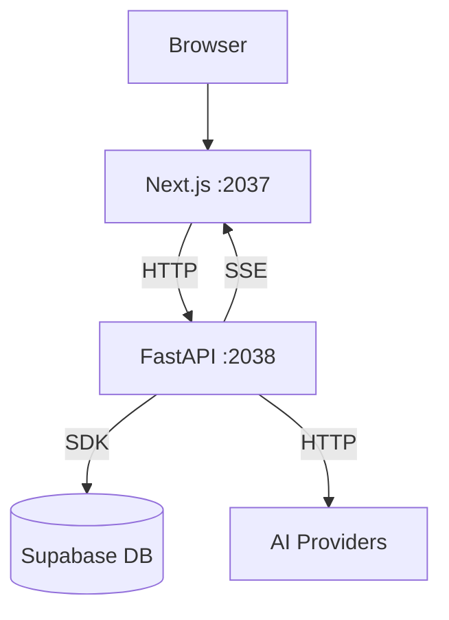

# Phase 0: 基础冻结与紧急修复

> 预估时间：3 天
> 前置依赖：无
> 负责人：羽升（全体确认）
> 阻断条件：本 Phase 未完成，禁止开始 Phase 1

---

## 目标

**冻结事实 + 消灭已知 Bug**——让团队对"当前是什么"达成一致，同时修复不修就会伤人的 P0。

---

## Task 0.1：P0 Bug 立即修复

### 0.1.1 ✅ 修复 `loop_runner.py:64` 双重赋值

**已修复**：`group_id = group_id = group_node["id"]` → `group_id = group_node["id"]`

### 0.1.2 ~~删除 `executor.py` 死代码~~ → 已验证：非死代码

**原始分析声称**：`executor.py:41` 的 `_build_context_prompt` 是死代码。

**实际验证**：该函数带有注释 `"""Compatibility helper retained for tests and diagnostics."""`，被 `tests/test_workflow_engine_property.py` (line 18, 130, 139, 140) 直接 import 使用。**这不是死代码而是测试兼容层。**

**处理**：保留。无需操作。

### 0.1.3 ✅ 删除前端重复 Barrel Export

**已删除**：`frontend/src/features/workflow/hooks/use-conversation-store.ts`
- 文件标记为 `@deprecated`
- 无任何消费方从此路径 import
- 所有引用已经使用规范路径 `@/stores/use-conversation-store`

> [!NOTE]
> 原计划 3 个 P0 中，1 个是误判（executor.py 非死代码）。实际修复 2 个。

---

## Task 0.2：冻结当前事实

### 0.2.1 当前仓库结构快照

输出一份 `docs/team/refactor/snapshot/repo-structure.md`，包含：
- 完整目录树（3 层深度）
- 每个顶级目录的行数/文件数统计
- 当前端口分配表（frontend:2037, backend:2038, ...）

### 0.2.2 当前运行链路图

绘制 Mermaid 图，覆盖：

### 0.2.3 当前 API 路由全量清单

从 `router.py` 提取，标注每个路由文件的：
- 行数
- 路由数量
- 是否有 usage_ledger 模式
- 域归属

> **关键输出**：`docs/team/refactor/snapshot/api-inventory.md`

### 0.2.4 当前节点重复定义清单

列出节点信息在以下 7 处的定义：

| # | 位置 | 定义内容 | 是否权威源 |
|---|------|----------|-----------|
| 1 | `backend/app/nodes/_base.py` | BaseNode 类 | ✅ 运行时权威 |
| 2 | `backend/app/nodes/__init__.py` | NODE_REGISTRY 静态导入 | 衍生 |
| 3 | `backend/app/api/nodes.py` | manifest API | 衍生 |
| 4 | `frontend/src/types/workflow.ts` | NodeType 类型 | ⚠️ 前端独立维护 |
| 5 | `frontend/src/features/workflow/constants/workflow-meta.ts` | 节点元数据 | ⚠️ 前端独立维护 |
| 6 | `frontend/src/components/layout/sidebar/NodeStoreDefaultView.tsx` | 商店分组 | ⚠️ 前端独立维护 |
| 7 | `frontend/src/features/workflow/components/nodes/renderers/index.ts` | RENDERER_REGISTRY | ⚠️ 前端独立维护 |

> **关键输出**：`docs/team/refactor/snapshot/node-definitions-audit.md`

---

## Task 0.3：冻结术语定义

团队三人签字确认以下术语表：

| 术语 | 精确定义 | 不等于 |
|------|---------|--------|
| **节点 Node** | 工作流执行单元，由主引擎调度，遵守 BaseNode 契约 | 不等于 插件 |
| **插件 Plugin** | 仓内独立模块，可暴露前端/后端/数据库/节点 | 不等于 单个 node.py |
| **社区节点 Community Node** | 用户发布的节点能力描述/模板，非直接运行代码 | 不等于 可安装的插件 |
| **子后端 Sub-backend** | 团队成员独立开发的 HTTP 服务，通过 Gateway 协议接入 | 不等于 主后端内的 service |
| **Agent Gateway** | 主后端中的统一子后端接入层 | 不等于 API 代理 |
| **Wiki** | 已稳定文档的发布源 | 不等于 设计文档主战场 |

> **关键输出**：`docs/team/refactor/snapshot/terminology.md`（需三人确认签字）

---

## Phase 0 完成标志

- [x] P0 Bug 修复完成（2/3 有效，1 个误判已纠正）
- [x] 仓库结构快照文档已输出 → `snapshot/repo-structure.md`
- [x] API 路由清单已输出 → `snapshot/api-inventory.md`
- [x] 节点重复定义审计已输出 → `snapshot/node-definitions-audit.md`
- [x] 术语表已输出 → `snapshot/terminology.md`（待三人签字）
- [x] 运行链路图已绘制（嵌入 `repo-structure.md`）

> [!IMPORTANT]
> **Gate 规则**：只有 Phase 0 的所有 checklist 全部 ✅，才能正式启动 Phase 1。这是"先冻结再实施"原则的硬性约束。
