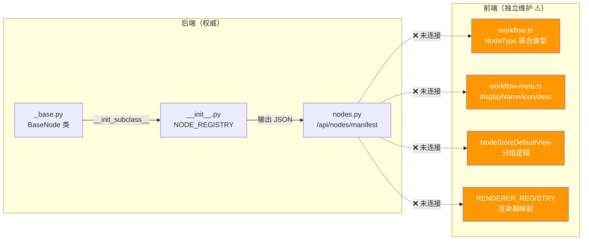

# 节点系统重复定义审计

> 审计时间：2026-04-09
> 用途：Phase 0 冻结记录，Phase 4 节点重构的输入

---

## 1. 节点定义的 7 个位置

### 后端（权威源 + 衍生）

| # | 文件 | 定义了什么 | 角色 | 是否可消除 |
|---|------|----------|------|----------|
| 1 | `nodes/_base.py` | `BaseNode` 类 + `__init_subclass__` 自动注册 | ✅ **运行时权威源** | 保留 |
| 2 | `nodes/__init__.py:45` | `NODE_REGISTRY = BaseNode.get_registry()` | 衍生：暴露注册表 | 保留（入口点） |
| 3 | `api/nodes.py` | `GET /api/nodes/manifest` → 返回所有节点元数据 JSON | 衍生：HTTP 暴露 | 保留（扩展字段） |

### 前端（独立维护 ⚠️）

| # | 文件 | 定义了什么 | 角色 | 是否可消除 |
|---|------|----------|------|----------|
| 4 | `types/workflow.ts:33` | `NodeType` 联合类型 | ⚠️ 前端独立维护 | → 可从 manifest 动态生成 |
| 5 | `features/workflow/constants/workflow-meta.ts` | 节点元数据（displayName, description, icon, category） | ⚠️ 前端独立维护 | → 可从 manifest 读取 |
| 6 | `components/layout/sidebar/NodeStoreDefaultView.tsx` | 节点商店分组逻辑 | ⚠️ 前端独立维护 | → 可从 manifest.category 动态分组 |
| 7 | `features/workflow/components/nodes/index.ts:38` | `RENDERER_REGISTRY` 渲染器映射 | ⚠️ 前端独立维护 | → 可从 manifest.renderer 动态映射（带兜底） |

---

## 2. 当前数据流



---

## 3. 目标数据流（Phase 4 实施后）

```mermaid
graph LR
    subgraph Backend["后端（权威）"]
        Base["_base.py<br/>BaseNode + renderer + version"]
        Reg["_registry.py<br/>动态发现"]
        API["nodes.py<br/>/api/nodes/manifest<br/>（含 renderer 字段）"]
        Base -->|discover_nodes()| Reg
        Reg -->|输出 JSON| API
    end

    subgraph Frontend["前端（manifest-first）"]
        Cache["manifest 缓存层"]
        Types["workflow.ts<br/>从 manifest 衍生"]
        Store["NodeStoreDefaultView<br/>从 category 动态分组"]
        Renderer["动态 Registry<br/>manifest.renderer → 组件"]
        Fallback["STATIC_RENDERERS<br/>兜底"]
    end

    API -->|fetch| Cache
    Cache --> Types
    Cache --> Store
    Cache --> Renderer
    Renderer -.->|fallback| Fallback

    style Cache fill:#4caf50,color:#fff
    style Fallback fill:#9e9e9e,color:#fff
```

---

## 4. 新增节点的当前成本 vs 目标成本

### 当前：新增 1 个节点需改 5+ 处

| 步骤 | 文件 | 操作 |
|------|------|------|
| 1 | `nodes/<category>/<name>/node.py` | 创建节点类 |
| 2 | `nodes/<category>/<name>/prompt.md` | 创建 prompt |
| 3 | `types/workflow.ts` | 添加 NodeType 值 |
| 4 | `workflow-meta.ts` | 添加元数据 |
| 5 | `nodes/index.ts` | 添加 RENDERER_REGISTRY 映射 |
| 6 | `NodeStoreDefaultView.tsx` | 可能需要调整分组 |

### 目标：新增 1 个节点只需改 2 处

| 步骤 | 文件 | 操作 |
|------|------|------|
| 1 | `nodes/<category>/<name>/node.py` | 创建节点类（含 renderer 字段） |
| 2 | `nodes/<category>/<name>/prompt.md` | 创建 prompt |
| (自动) | `_registry.py` | 启动时自动发现 |
| (自动) | `/api/nodes/manifest` | 自动暴露 |
| (自动) | 前端 manifest 缓存 | 自动读取 |

---

## 5. 风险评估

| 风险 | 级别 | 缓解措施 |
|------|------|---------|
| manifest 加载延迟导致首屏闪烁 | 中 | 静态兜底 + preload |
| 新字段向后不兼容 | 低 | 所有新字段有默认值 |
| 动态发现遗漏节点 | 低 | 启动日志打印已注册节点列表 |
| 前端 renderer 名不匹配 | 中 | 静态映射表兜底 |
