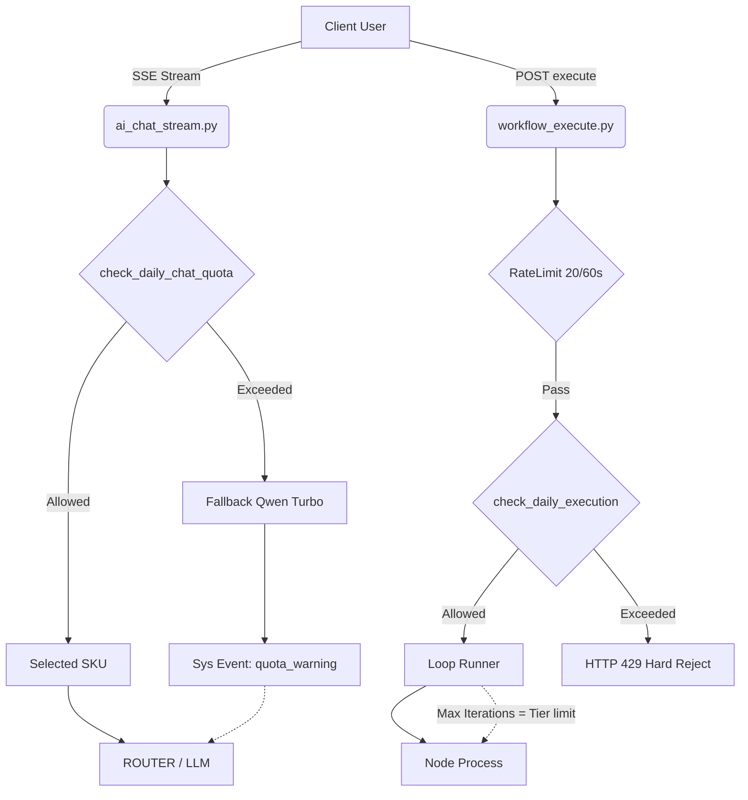

# StudySolo 会员额度与资源管控系统架构

**完成日期**: 2026-04-09
**覆盖模块**: AI 对话引擎、工作流执行引擎配置、用量分析控制

## 1. 架构目标
彻底取代过去的内存易失性 `limit`，转为完全由持久层 (`ss_ai_requests`) 驱动的基于用户当前订阅级别（Free/Pro/Pro+/Ultra）的细粒度用量访问控制。

## 2. 设计规范

### 2.1 时区规范
所有的每日限制严格使用**北京时间 (CST, UTC+8)**进行自然日结算（每日 00:00:00 重置）。避免与世界时间偏差导致的本地错觉。

### 2.2 防御阻断设计模型

系统实现了「组合降级模型」（Graceful Degradation & Hard Barrier）：

1. **AI Chat 对话系统（软限制）**
   - 利用 `_get_cst_today_start_utc` 查询当天 `ss_ai_requests` (source_type = 'assistant') 次数。
   - 当超出阶梯额度，修改后续选用模型强制 fallback 为 Qwen Turbo (`sku_dashscope_qwen_turbo_native`)。
   - 后台发信号：抛出一次性的 JSON 数据 `quota_warning=True` 以供前端渲染通知（对对话文本做侵入极小化）。

2. **WorkFlow 执行系统（硬限制）**
   - 前置已有令牌防刷限制：20请求/分钟（Burst 防御）。
   - 后置日累计查询防刷（Quota 防御）：超出当日上限立刻 raise `HTTP 429` 阻断。
   - **循环引擎安全帽**：`loop_runner.py` 内的 `maxIterations` 将过去的 100 次死循环硬顶优化为与 User Tier 挂钩（5→20→100→无限）。杜绝黑客利用简单节点制造巨型无限流操作。

## 3. 实现拓扑概览

## 4. 后续演进点 (Roadmap)

1. **并发限流 (`Concurrent Workflow Executor Limit`)** 
   - 现状：由于 SSE 断联等未正常结束的 `ss_workflow_runs` 会留下 `status='running'` 遗种。
   - 方案需要：首先构建出「心跳检测超时收割机制」来主动清退死亡 Run，其后才能依赖全表 Scan 判断活跃并发数是否超出 Tier 要求。
2. **云盘容量额度**：针对目前在 Supabase Storage 的知识文件限制需要结合 Storage REST API 继续定制限制。
